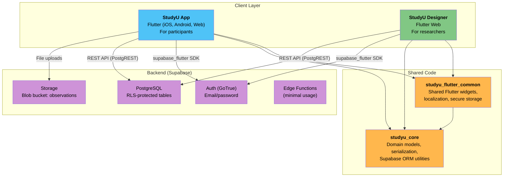

# Developer Documentation

StudyU is an open-source platform for designing and running N-of-1 clinical trials on participants' smartphones. It consists of two Flutter applications sharing a common core library, backed by Supabase (PostgreSQL + Auth + Storage).

## System Architecture

## Tech Stack

| Layer | Technology | Notes |
|---|---|---|
| **Mobile / Web apps** | Flutter / Dart 3.8+ | Two apps from one codebase |
| **App state (participants)** | Provider + ChangeNotifier | Lightweight, mobile-first |
| **App state (researchers)** | Riverpod + code gen | Complex async form workflows |
| **Routing (participants)** | Navigator 1.0 | Named routes, imperative |
| **Routing (researchers)** | GoRouter v17 | URL-driven, auth guards |
| **Form handling (researchers)** | reactive_forms | Debounced auto-save |
| **Serialization** | json_serializable | Compile-time safety, code-generated |
| **Monorepo tooling** | Melos | Script runner, package linking |
| **Backend** | Supabase | PostgreSQL + Auth + Storage + PostgREST |
| **Database** | PostgreSQL 15 | RLS on all tables |
| **Authentication** | GoTrue (Supabase) | Email/password only |
| **Error tracking** | Sentry | Analytics opt-in |

## Key Architectural Decisions

| Decision | Choice | Rationale |
|---|---|---|
| Monorepo | Melos-managed workspace | Shared models and utilities across two apps |
| Backend | Supabase (hosted PostgreSQL) | Auth, RLS, real-time, and storage out of the box |
| State management (App) | Provider | Lightweight, sufficient for mobile-first participant flows |
| State management (Designer) | Riverpod | Complex form workflows and async data management |
| Serialization | json_serializable (code gen) | Compile-time safety for 30+ model classes |
| Offline strategy | Exception-based fallback + cache sync | Pragmatic for clinical data entry in low-connectivity scenarios |

## Reading Order for New Developers

If you are new to StudyU, follow this sequence:

1. **[Domain Model: N-of-1 Trials](./02-domain-model/01-n-of-1-trials.mdx)** — understand the clinical research concepts before touching code
2. **[Domain Model: Core Entities](./02-domain-model/02-core-entities.mdx)** — learn what Study, Intervention, Observation, and Subject mean in the codebase
3. **[Domain Model: Entity Relationships](./02-domain-model/03-entity-relationships.mdx)** — see how entities connect via diagrams
4. **[Domain Model: Concrete Example](./02-domain-model/04-concrete-example.mdx)** — walk through the Vitamin D trial end-to-end
5. **[Architecture: System Overview](./03-architecture/01-system-overview.mdx)** — high-level architecture and tech stack
6. **[Architecture: Monorepo Structure](./03-architecture/02-monorepo-structure.mdx)** — packages, dependencies, Melos scripts
7. **[Local Setup: Prerequisites](./06-local-setup/01-prerequisites.mdx)** — tools to install
8. **[Local Setup: Clone and Bootstrap](./06-local-setup/02-clone-and-bootstrap.mdx)** — get the repo running
9. **[Local Setup: Running Apps](./06-local-setup/04-running-apps.mdx)** — start the apps locally

## Documentation Sections

| Section | What it covers |
|---|---|
| [Domain Model](./02-domain-model/01-n-of-1-trials.mdx) | N-of-1 trial concepts, entity glossary, ERD diagrams, concrete walkthrough |
| [Architecture](./03-architecture/01-system-overview.mdx) | System design, monorepo, frontend patterns, Supabase backend, offline sync |
| [App Reference](./04-app-reference/01-screen-map.mdx) | Participant app screen flow, task system, widget reference |
| [Designer Reference](./05-designer-reference/01-screen-map.mdx) | Researcher app navigation, design tabs, management screens, form patterns |
| [Local Setup](./06-local-setup/01-prerequisites.mdx) | Prerequisites, clone, Supabase, running apps, environment config, code generation |
| [Development Workflow](./07-development-workflow/01-edit-build-test.mdx) | Daily workflow, coding conventions, IDE setup, troubleshooting |
| [Database Reference](./08-database-reference/01-schema.mdx) | Tables, columns, computed functions, RLS policies, migrations |
| [JSON Schema Reference](./09-json-schema-reference/01-overview.mdx) | Complete JSON structure of every model class with examples |
