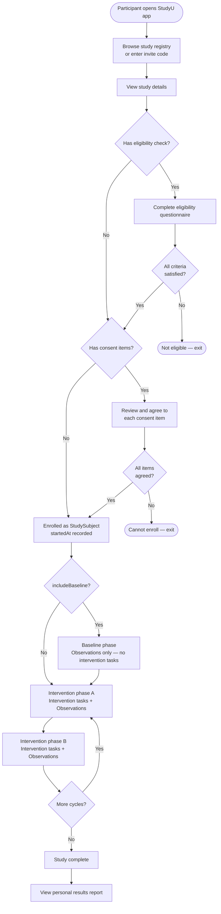
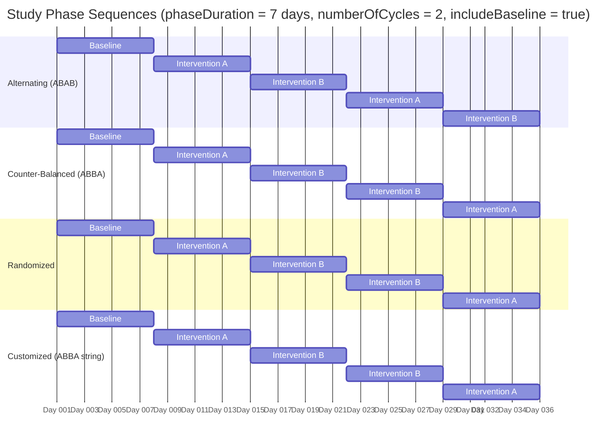
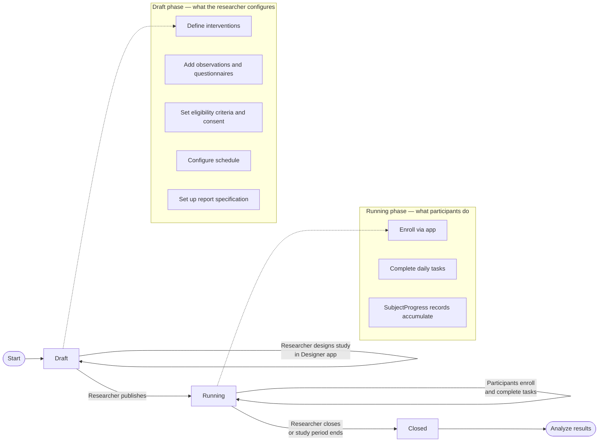

# What is an N-of-1 Trial?

This document is the entry point for developers joining the StudyU project who know Flutter but have no background in clinical research. Understanding the research concept behind the product is the key to understanding why the data model looks the way it does.

## The problem with traditional clinical trials

A standard Randomized Controlled Trial (RCT) enrolls hundreds or thousands of participants, randomly assigns them to a treatment or a placebo group, and then measures the *average* treatment effect across the group. This answers the question "does this drug work for people *on average*?" — but it says nothing about whether the drug will work for *you specifically*.

## What an N-of-1 trial is

An N-of-1 trial studies a **single participant** across time. Instead of comparing two groups of different people, it compares the *same person* across different treatment phases. The participant alternates between an active treatment (Intervention A) and a control or alternative treatment (Intervention B), repeating the cycle multiple times. Because the same person experiences both conditions, many sources of individual variability are controlled automatically.

This answers a different question: **"Does this treatment work for this individual?"**

## Why this matters for StudyU

StudyU is a platform that lets researchers design and run N-of-1 trials digitally, using participants' smartphones. The clinical insight translates directly into product requirements:

- A study must have **at least two intervention arms** to alternate between.
- A study has a **schedule** that dictates which arm is active on which days.
- Data is collected through **tasks** that participants complete on each study day.
- Results are meaningful *per participant*, not only in aggregate.

## How a typical N-of-1 trial runs

## Phase sequences

The order of intervention phases within each cycle is configurable by the researcher:

> **Note:** Each bar is one phase lasting `phaseDuration` days. The counter-balanced and customized sequences shown above happen to produce the same output (ABBA) — the difference is that `customized` takes a researcher-provided string, while `counterBalanced` is computed by the `_generateCounterBalancedCycle` algorithm.

## The study lifecycle

## What this means in code

The N-of-1 structure maps directly to the domain model:

| Clinical concept | Code entity | Where to find it |
|---|---|---|
| The trial protocol | `Study` | `core/lib/src/models/tables/study.dart` |
| A treatment arm | `Intervention` | `core/lib/src/models/interventions/intervention.dart` |
| A task the participant does per phase | `CheckmarkTask` | `core/lib/src/models/interventions/tasks/checkmark_task.dart` |
| A measurement taken every phase | `QuestionnaireTask` | `core/lib/src/models/observations/tasks/questionnaire_task.dart` |
| The trial schedule | `StudySchedule` | `core/lib/src/models/study_schedule/study_schedule.dart` |
| An enrolled participant | `StudySubject` | `core/lib/src/models/tables/study_subject.dart` |
| A single task completion | `SubjectProgress` | `core/lib/src/models/tables/subject_progress.dart` |

Continue to [Core Entities](./02-core-entities.mdx) for the full glossary of each domain object.
