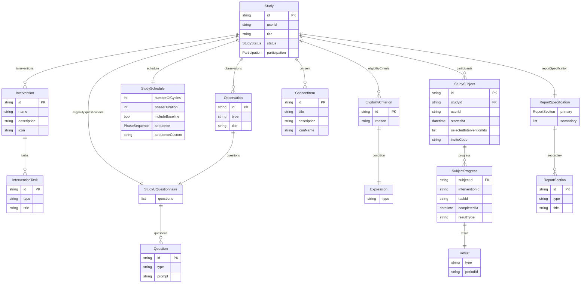
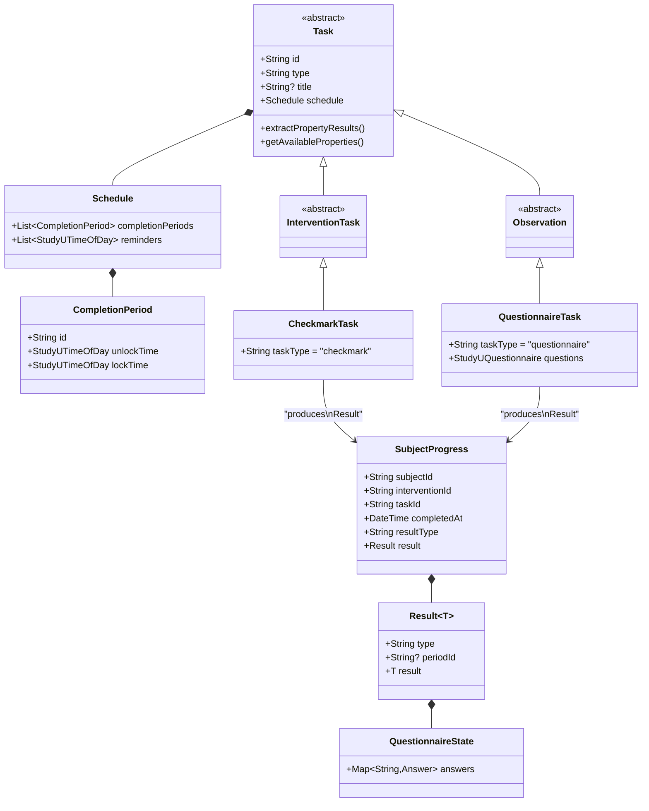
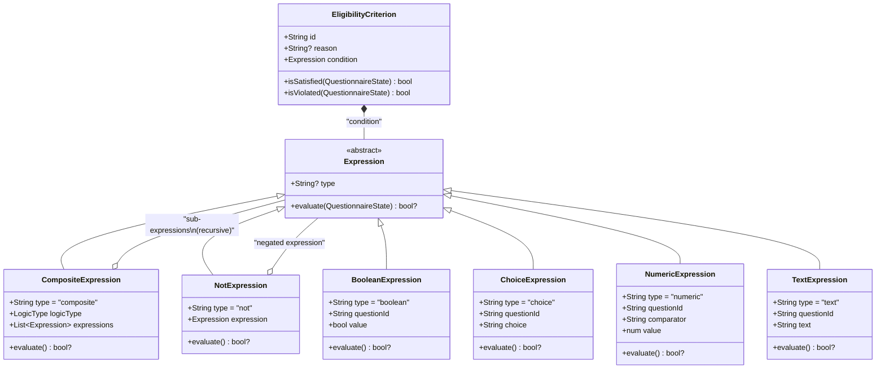
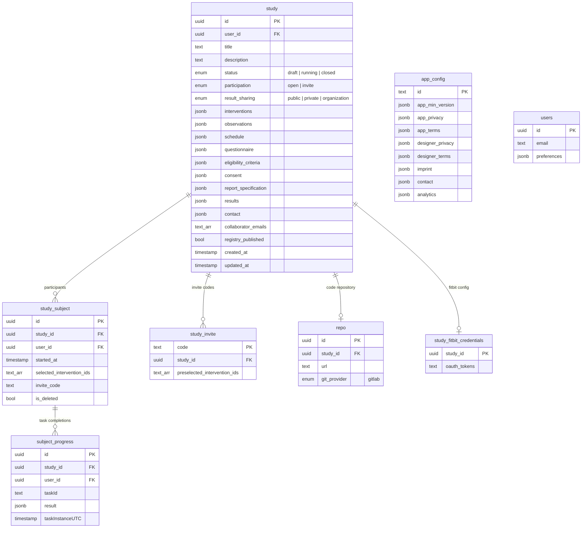

# Entity Relationships

This page shows the relationships between all StudyU domain entities via diagrams. For field-by-field descriptions, see [Core Entities](./02-core-entities.mdx).

## Entity Relationship Diagram

The full domain model as an ERD. `Study` is the aggregate root — all other entities hang off it directly or indirectly.



## Task and Data Collection Model

This class diagram shows the task type hierarchy and how task completions produce typed results.



## Eligibility Expression Tree

The expression system is a recursive tree of conditions used for eligibility criteria and question conditionals.



**Example expression tree** for the criterion "participant is a non-smoker AND is between 18 and 65 years old":

```
CompositeExpression (AND)
├── BooleanExpression(questionId: "q_smoker", value: false)
└── CompositeExpression (AND)
    ├── NumericExpression(questionId: "q_age", comparator: ">=", value: 18)
    └── NumericExpression(questionId: "q_age", comparator: "<=", value: 65)
```

An empty `CompositeExpression` evaluates to `true` (no conditions = always passes).

## Database Table Relationships

The database-level ERD showing how the Supabase tables map to each other:



:::info
Most study configuration (interventions, observations, schedule, eligibility criteria, consent, report) is stored as **JSONB columns** on the `study` table. Only participant data (`study_subject`, `subject_progress`) is normalized into separate tables.
:::
