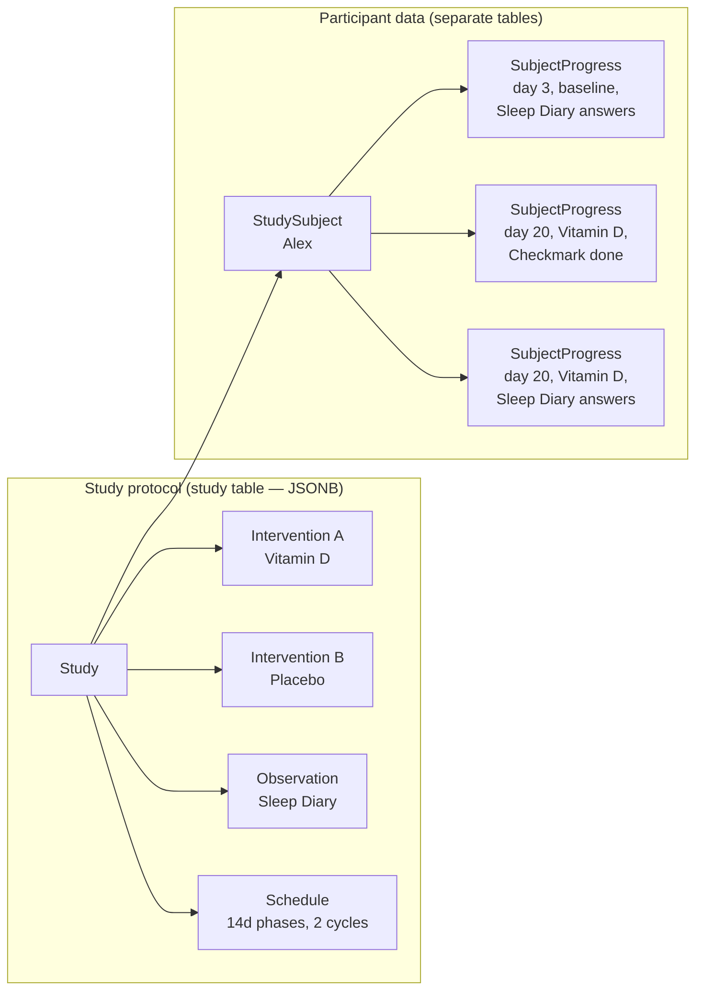

# Concrete Example: Vitamin D and Sleep Quality

This walkthrough uses a realistic study to show how all domain entities fit together in practice. Read [Core Entities](./02-core-entities.mdx) first if you haven't already.

## The scenario

Dr. Smith wants to test whether taking 2000 IU of Vitamin D daily improves sleep quality in adults who report poor sleep. She opens StudyU Designer and creates a new study.

## Step 1 — Configuring the Study

Dr. Smith creates a `Study` with:
- `title`: "Vitamin D and Sleep Quality"
- `status`: `draft`
- `participation`: `invite` (she will recruit participants herself)

## Step 2 — Defining interventions

She adds two `Intervention` objects to `study.interventions`:

- **Intervention A:** `name = "Vitamin D 2000 IU"`, with one `CheckmarkTask` titled "Take your Vitamin D supplement". The `CheckmarkTask` has a `Schedule` with a `CompletionPeriod` from 07:00 to 10:00 and a reminder at 08:00.
- **Intervention B:** `name = "Placebo"`, with one `CheckmarkTask` titled "Take your placebo tablet". Same schedule.

## Step 3 — Setting up observations

She adds one `Observation` to `study.observations`: a `QuestionnaireTask` titled "Sleep Diary" containing two questions:
- A `ScaleQuestion` (id: `q_sleep_quality`, prompt: "How would you rate your sleep quality last night? (1–10)")
- A `BooleanQuestion` (id: `q_woke_up`, prompt: "Did you wake up during the night?")

This `QuestionnaireTask` will appear in the participant's task list every morning throughout the entire study — baseline, Vitamin D phase, and placebo phase — because observations are not phase-specific.

## Step 4 — Eligibility screening

Dr. Smith wants only adults aged 18+ who self-report poor sleep. She adds two questions to `study.questionnaire`:
- A `ScaleQuestion` (id: `q_sleep_baseline`, prompt: "On average, how would you rate your sleep quality? (1–10)")
- A `BooleanQuestion` (id: `q_age_ok`, prompt: "Are you 18 years of age or older?")

She then adds two `EligibilityCriterion` entries to `study.eligibilityCriteria`:
- Criterion 1: `reason = "You must be 18 or older"`, `condition = BooleanExpression(questionId: "q_age_ok", value: true)`
- Criterion 2: `reason = "This study is for people who experience poor sleep"`, `condition = NumericExpression(questionId: "q_sleep_baseline", comparator: "<=", value: 5)`

## Step 5 — Consent

She adds two `ConsentItem` entries to `study.consent`:
- "Data Storage": explains that anonymized responses are stored on secure servers
- "Right to Withdraw": explains the participant can leave at any time

## Step 6 — Schedule

She configures `study.schedule`:
- `phaseDuration = 14` (two-week phases)
- `numberOfCycles = 2` (two full A/B cycles)
- `includeBaseline = true` (two weeks of baseline before interventions start)
- `sequence = PhaseSequence.alternating`

Total study length: 14 (baseline) + 14×4 (four phases) = **70 days**.

## Step 7 — Publish and enroll

Dr. Smith changes `status` to `running` and distributes invite codes. When participant Alex joins:

1. Alex answers the eligibility questionnaire. The app evaluates each `EligibilityCriterion.condition` against Alex's `QuestionnaireState`. Both pass (`q_age_ok = true`, `q_sleep_baseline = 3`).
2. Alex reviews and accepts both `ConsentItem` entries.
3. A `StudySubject` is created:
   - `userId = Alex`
   - `studyId = study.id`
   - `selectedInterventionIds = [interventionA.id, interventionB.id]`
   - `startedAt = today`
4. `interventionOrder` is computed: `['__baseline', 'A', 'B', 'A', 'B']`.

## Step 8 — Daily data collection

On **day 3** (still baseline), Alex opens the app. `StudySubject.scheduleFor(today)` is called:
- `getInterventionForDate(today)` returns the baseline `Intervention` (empty task list).
- The intervention task loop produces nothing (baseline has no tasks).
- The observation loop adds the "Sleep Diary" `QuestionnaireTask`.

Alex completes the Sleep Diary. A `SubjectProgress` record is written:
- `subjectId = Alex's subject id`
- `interventionId = '__baseline'`
- `taskId = sleepDiaryTask.id`
- `completedAt = now (UTC)`
- `resultType = 'QuestionnaireState'`
- `result = Result<QuestionnaireState>` containing `{q_sleep_quality: 4, q_woke_up: true}`

On **day 20** (first Vitamin D phase), the same `scheduleFor` call now returns both the "Take your Vitamin D supplement" `CheckmarkTask` and the "Sleep Diary" `QuestionnaireTask`. Two separate `SubjectProgress` records are written when Alex completes them.

## Step 9 — Results

After 70 days, Dr. Smith closes the study. She views the report, which uses `ReportSpecification` sections to compare Alex's average `q_sleep_quality` score during Vitamin D phases versus placebo phases. Because this is an N-of-1 trial, the comparison is meaningful for Alex specifically — it tells Dr. Smith whether Vitamin D helped *this person*, independent of what it does for the population average.

## How the data maps to code

The key insight is that the study protocol lives in a single JSONB-heavy `study` row, while participant activity is normalized into `study_subject` and `subject_progress` rows. This design keeps the protocol immutable during the study while allowing participant data to accumulate over time.
