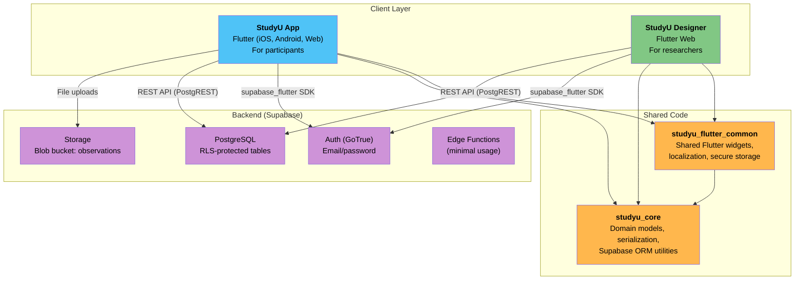
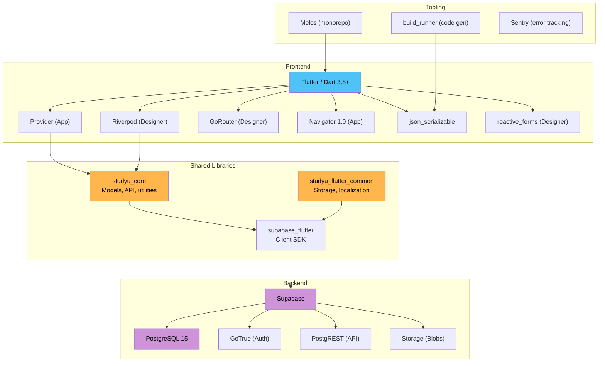

# System Overview

StudyU is a platform for running N-of-1 clinical trials digitally. The system consists of two Flutter applications sharing a common core library, backed by Supabase (PostgreSQL + Auth + Storage).

## System diagram

## Key architectural decisions

| Decision | Choice | Rationale |
|---|---|---|
| Monorepo | Melos-managed workspace | Shared models and utilities across two apps |
| Backend | Supabase (hosted PostgreSQL) | Auth, RLS, real-time, and storage out of the box |
| State management (App) | Provider | Lightweight, sufficient for mobile-first participant flows |
| State management (Designer) | Riverpod | Complex form workflows and async data management |
| Serialization | json_serializable (code gen) | Compile-time safety for 30+ model classes |
| Offline strategy | Exception-based fallback + cache sync | Pragmatic for clinical data entry in low-connectivity scenarios |

## Technology stack

## The two apps compared

| Aspect | App (Participants) | Designer (Researchers) |
|---|---|---|
| **State management** | Provider (`ChangeNotifier`) | Riverpod (`flutter_riverpod` + `riverpod_generator`) |
| **Routing** | Navigator 1.0 (`onGenerateRoute`) | GoRouter v17 (declarative, route guards) |
| **Target platforms** | iOS, Android, Web | Web only |
| **Form handling** | Standard Flutter forms | `reactive_forms` |
| **Layout** | Single-column, mobile-first | Responsive two-column |
| **API pattern** | Direct `SupabaseQuery` calls | Repository pattern with `StudyUApiClient` |
| **Code generation** | `json_serializable` | `json_serializable` + `riverpod_generator` |

Continue to [Monorepo Structure](./02-monorepo-structure.mdx) for the package dependency graph and Melos scripts.
