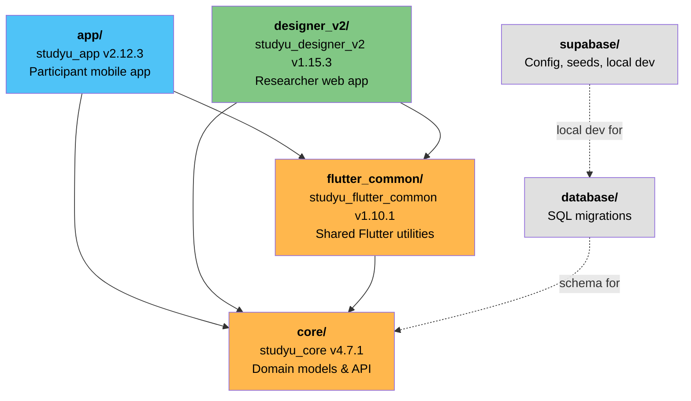

# Monorepo Structure

StudyU uses [Melos](https://melos.invertase.dev/) to manage a Dart/Flutter monorepo. The four packages have a strict dependency hierarchy.

## Package dependency graph



## Package responsibilities

| Package | Directory | Purpose |
|---|---|---|
| `studyu_core` | `core/` | Domain models (`Study`, `Intervention`, `SubjectProgress`, etc.), JSON serialization, Supabase ORM base classes (`SupabaseObject`, `SupabaseQuery`), CSV export, Fitbit integration |
| `studyu_flutter_common` | `flutter_common/` | Secure storage wrapper, environment loader (`.env` files), `AppLanguage` ChangeNotifier, Supabase initialization with URL failover |
| `studyu_app` | `app/` | Participant-facing app: study browsing, enrollment, daily task completion, offline caching, result reports |
| `studyu_designer_v2` | `designer_v2/` | Researcher-facing web app: study design forms, participant monitoring, recruitment, data analysis and export |

## Directory layout

```
studyu/
├── app/                               # studyu_app — participant app
├── core/                              # studyu_core — domain models
├── database/
│   └── migration/                     # 16 SQL migration files
├── designer_v2/                       # studyu_designer_v2 — researcher app
├── flutter_common/                    # studyu_flutter_common — shared Flutter code
│   └── lib/envs/                      # .env files for all environments
├── supabase/
│   ├── config.toml                    # Supabase local dev config
│   ├── seed.sql                       # Test data seeding
│   └── functions/                     # Edge functions (minimal)
├── melos.yaml                         # Monorepo scripts
└── pubspec.yaml                       # Root dev dependencies (lint config)
```

## Melos scripts

All scripts are defined in `melos.yaml` and run from the repo root with `melos run <script>` or `melos <shortcut>`.

**Run commands:**

```bash
melos app                    # Run participant app on web (port 8080)
melos designer_v2            # Run designer app on web (port 8081)
```

**Build commands:**

```bash
melos build:web:app          # Production web build for app
melos build:web:designer_v2  # Production web build for designer
```

**Development commands:**

```bash
melos run generate           # Run build_runner for code generation
melos run qualitycheck       # Format + generate + analyze (run before PRs)
melos run test               # Run flutter test in all packages with tests
melos format                 # Format all Dart files
melos run fix                # Apply auto-fixable lint errors
melos run reset              # Full clean reset: git clean + melos clean + flutter clean + bootstrap
melos run outdated           # List outdated dependencies
melos run upgrade            # Upgrade all dependencies
```

**Environment-specific run commands:**

```bash
melos run local:app          # App against local Supabase (port 8080)
melos run local:designer_v2  # Designer against local Supabase (port 8081)
melos run dev:app            # App against dev database (port 8080)
melos run dev:designer_v2    # Designer against dev database (port 8081)
```

## App directory structure

### StudyU App — screen-based

```
app/lib/
├── main.dart                          # Entry point
├── routes.dart                        # Route definitions
├── models/
│   └── app_state.dart                 # Core state (ChangeNotifier)
├── screens/
│   ├── app_onboarding/                # Welcome, loading, error, outdated
│   │   ├── loading_screen.dart        # Entry + offline sync logic
│   │   └── welcome.dart
│   └── study/
│       ├── onboarding/                # Enrollment flow
│       │   ├── study_selection.dart
│       │   ├── study_overview.dart
│       │   ├── intervention_selection.dart
│       │   ├── consent.dart
│       │   └── kickoff.dart
│       ├── dashboard/                 # Main participant view
│       │   ├── dashboard.dart
│       │   └── settings.dart
│       ├── tasks/                     # Task completion screens
│       └── report/                    # Result visualizations
├── util/
│   ├── cache.dart                     # Offline cache management
│   ├── study_subject_extension.dart   # Offline result submission
│   └── temporary_storage_handler.dart # Multimodal file staging
└── widgets/                           # Reusable UI components
    ├── questionnaire/                 # Question type widgets
    └── report/                        # Chart widgets
```

### StudyU Designer — feature-based

```
designer_v2/lib/
├── main.dart                          # Entry point
├── routing/
│   ├── router.dart                    # GoRouter with auth guard
│   └── router_config.dart             # Route definitions
├── repositories/
│   ├── auth_repository.dart           # Auth state (RxDart BehaviorSubject)
│   ├── api_client.dart                # StudyUApiClient
│   └── supabase_client.dart           # Client initialization
├── features/
│   ├── auth/                          # Login, signup, password recovery
│   ├── dashboard/                     # Studies list with filters
│   ├── design/
│   │   ├── info/                      # Study metadata form
│   │   ├── enrollment/                # Consent & screener config
│   │   ├── interventions/             # Intervention builder
│   │   ├── measurements/              # Observation/survey builder
│   │   └── reports/                   # Report config
│   ├── monitor/                       # Participant tracking
│   ├── recruit/                       # Invite code management
│   ├── analyze/                       # Data export & analysis
│   └── study/                         # Study settings & details
└── common_views/                      # Shared layout components
    ├── form_scaffold.dart
    ├── layout_two_column.dart
    └── async_value_widget.dart
```
