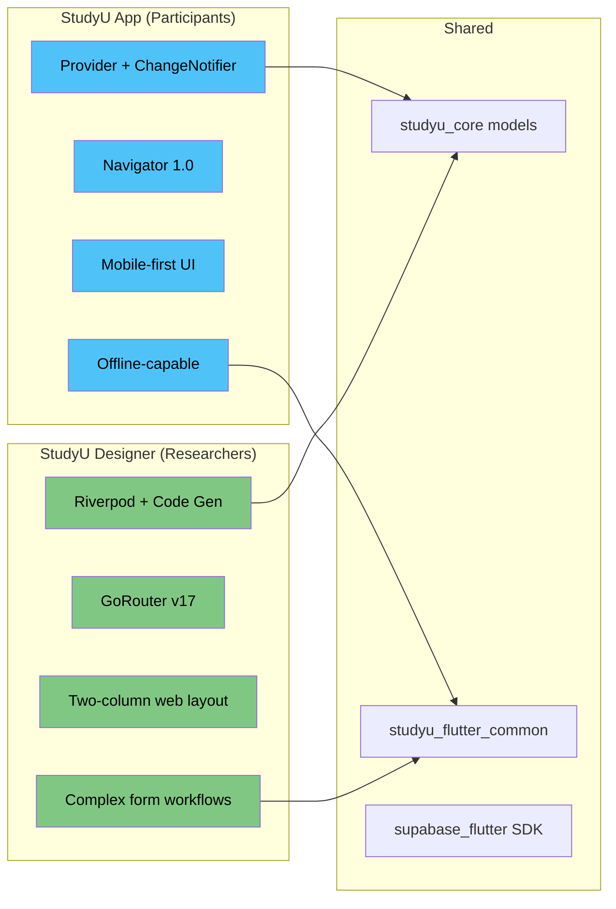
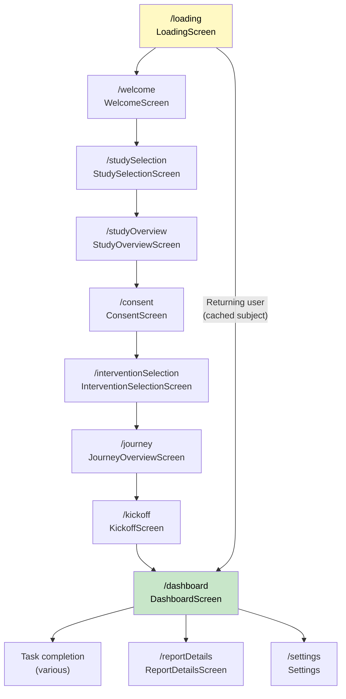
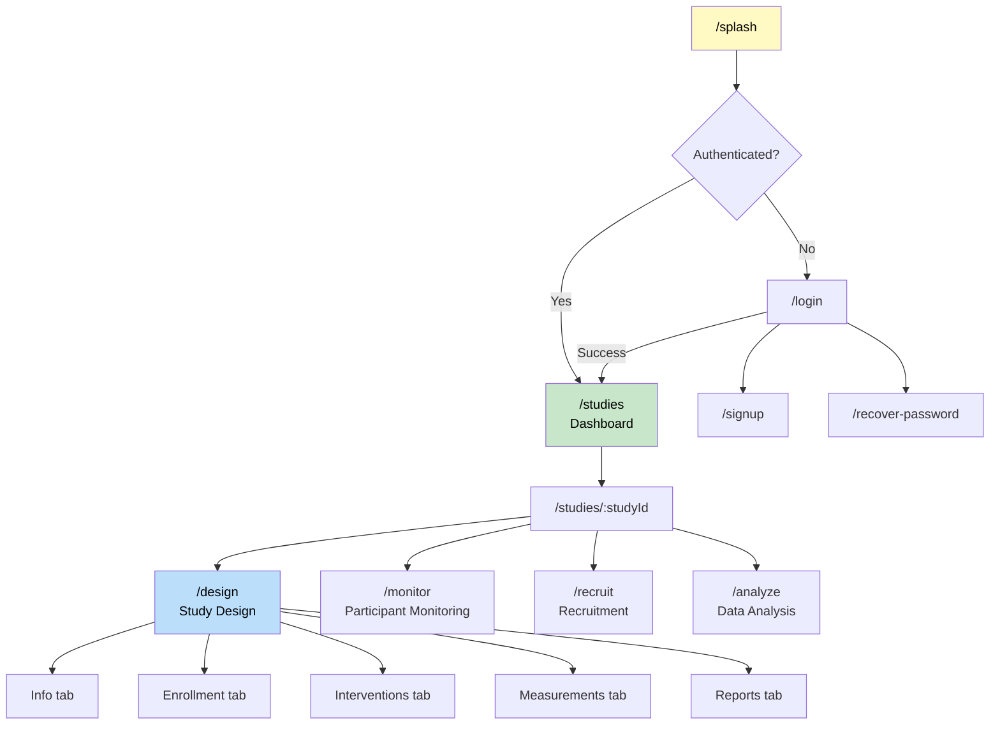
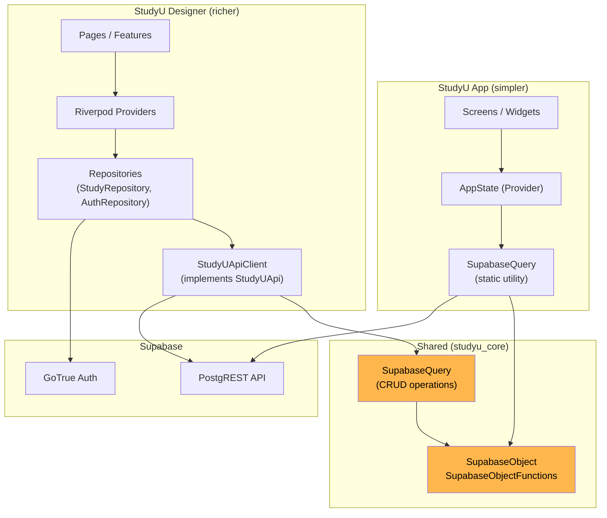

# Frontend Architecture

The two Flutter apps serve fundamentally different users and use different architectural patterns optimized for their use cases.

## Two apps, one core



| Aspect | App (Participants) | Designer (Researchers) |
|---|---|---|
| **State management** | Provider (`ChangeNotifier`) | Riverpod (`flutter_riverpod` + `riverpod_generator`) |
| **Routing** | Navigator 1.0 (`onGenerateRoute`) | GoRouter v17 (declarative, route guards) |
| **Target platforms** | iOS, Android, Web | Web only |
| **Form handling** | Standard Flutter forms | `reactive_forms` |
| **Layout** | Single-column, mobile-first | Responsive two-column |
| **API pattern** | Direct `SupabaseQuery` calls | Repository pattern with `StudyUApiClient` |
| **Code generation** | `json_serializable` | `json_serializable` + `riverpod_generator` |

---

## State Management

### StudyU App — Provider

The participant app uses [Provider](https://pub.dev/packages/provider) with `ChangeNotifier` classes. Two providers are configured at the app root.

**Entry point:** `app/lib/main.dart`

```dart
// Simplified from main.dart
MultiProvider(
  providers: [
    ChangeNotifierProvider<AppLanguage>(create: (_) => AppLanguage()),
    ChangeNotifierProvider<AppState>(create: (_) => AppState()),
  ],
  child: MyApp(),
)
```

- **`AppLanguage`** (`flutter_common/lib/src/utils/app_language.dart`) — manages the application locale. Persists language preference to `FlutterSecureStorage`.
- **`AppState`** (`app/lib/models/app_state.dart`) — the core state container. Holds the active `StudySubject`, selected study, active interventions, and preview mode flag. Screens access state via `Consumer<AppState>` or `context.read<AppState>()`.

This is a lightweight approach — the participant app's state is essentially one object (`AppState`) that tracks which study the user is in and their current progress.

### StudyU Designer — Riverpod

The designer app uses [Riverpod](https://riverpod.dev/) with code generation for more complex state management needs.

**Entry point:** `designer_v2/lib/main.dart`

```dart
// Simplified from main.dart
ProviderScope(
  child: App(),
)
```

Key providers (defined in `designer_v2/lib/repositories/`):

| Provider | Purpose |
|---|---|
| `supabaseClientProvider` | Singleton Supabase client instance |
| `authRepositoryProvider` | Authentication state (login, signup, session) |
| `apiClientProvider` | `StudyUApiClient` for all database operations |
| `studyRepositoryProvider` | Study CRUD with caching and optimistic updates |
| `routerProvider` | GoRouter instance with auth-aware redirects |

The designer uses Riverpod because its study design workflow involves deeply nested forms (interventions, observations, schedules, eligibility criteria), where fine-grained reactivity and async state management are essential. Form controllers extend Riverpod's `ConsumerStatefulWidget` pattern.

---

## Routing & Navigation

### StudyU App — Navigator 1.0

The participant app uses Flutter's classic imperative navigation with named routes.

**Route definitions:** `app/lib/routes.dart`



Navigation is imperative — screens call `Navigator.pushNamedAndRemoveUntil()` or `Navigator.pushReplacementNamed()` to navigate. URL query parameters are supported for web (e.g., `?studyId=xxx&preview=true`).

### StudyU Designer — GoRouter

The designer app uses [GoRouter](https://pub.dev/packages/go_router) for declarative, URL-driven navigation with auth guards.

**Router config:** `designer_v2/lib/routing/router.dart` and `designer_v2/lib/routing/router_config.dart`



The router includes an **auth redirect guard** that:
1. Redirects unauthenticated users to `/login`
2. Preserves the intended destination via a `from` query parameter
3. Handles password recovery deep links
4. Redirects authenticated users away from login/signup pages

---

## Data Layer & API Communication

Both apps communicate with Supabase through a layered data architecture, but the layers differ in complexity.



### Core ORM: SupabaseObject

All database entities in `studyu_core` extend `SupabaseObjectFunctions<T>`, which provides:

- `toJson()` — serialize to JSON for database writes
- `fromJson()` (factory) — deserialize from JSON
- `tableName` — static constant mapping to the Supabase table name
- `primaryKeys` — map of primary key columns

**File:** `core/lib/src/util/supabase_object.dart`

`SupabaseQuery` provides static CRUD methods:

```dart
// Core query operations (simplified)
SupabaseQuery.getAll<T extends SupabaseObject>()
SupabaseQuery.getById<T extends SupabaseObject>(id)
SupabaseQuery.getByColumn<T extends SupabaseObject>(column, value)
// Writes use upsert by default
object.save()    // Insert or update
object.delete()  // Delete by primary key
```

### Designer API Client

The designer wraps these primitives in a domain-specific API client.

**File:** `designer_v2/lib/repositories/api_client.dart`

```dart
// Key StudyUApiClient methods (simplified)
Future<Study> saveStudy(Study study)
Future<Study> fetchStudy(StudyID studyId)
Future<List<Study>> getUserStudies({withParticipantActivity, forDashboard})
Future<void> deleteStudy(Study study)
Future<StudyInvite> fetchStudyInvite(String code)
Future<Study> fetchStudyFromInvite(String code)  // RPC call
Future<List<StudySubject>> deleteParticipants(Study, List<StudySubject>)
Future<AppConfig> fetchAppConfig()
Future<StudyUUser> fetchUser(String userId)
Future<StudyUUser> saveUser(StudyUUser user)
```

Error handling uses custom exception types (`StudyNotFoundException`, `UserNotFoundException`, etc.) that wrap Supabase's `PostgrestException`.
