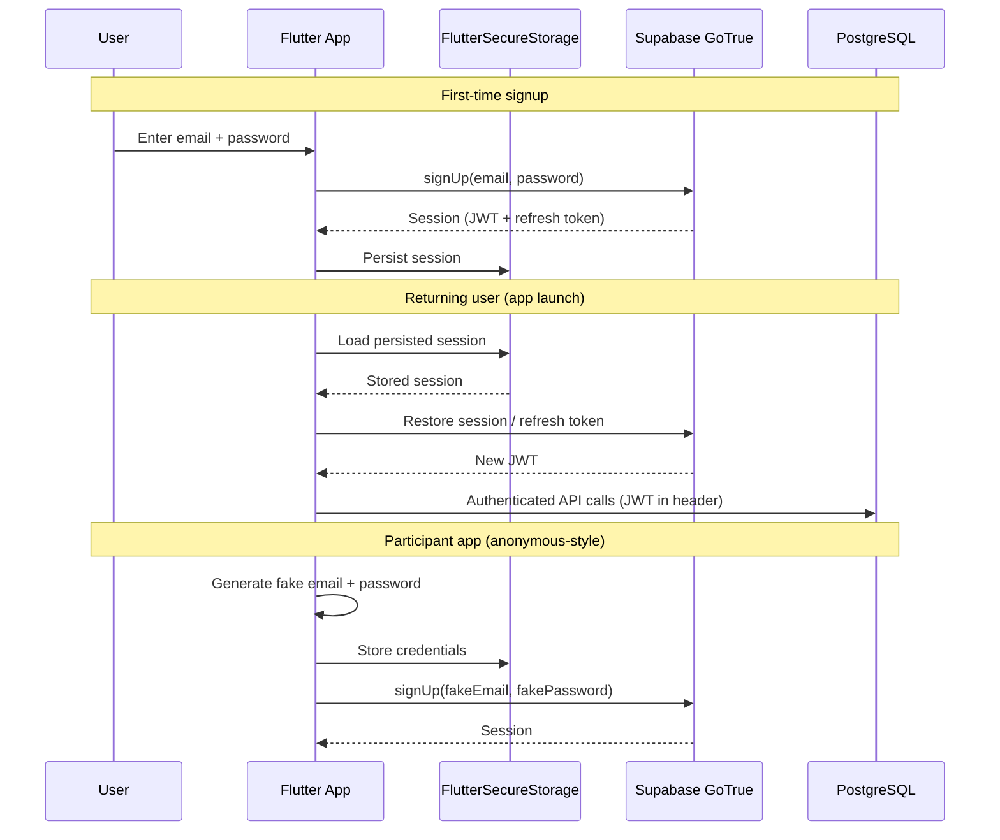
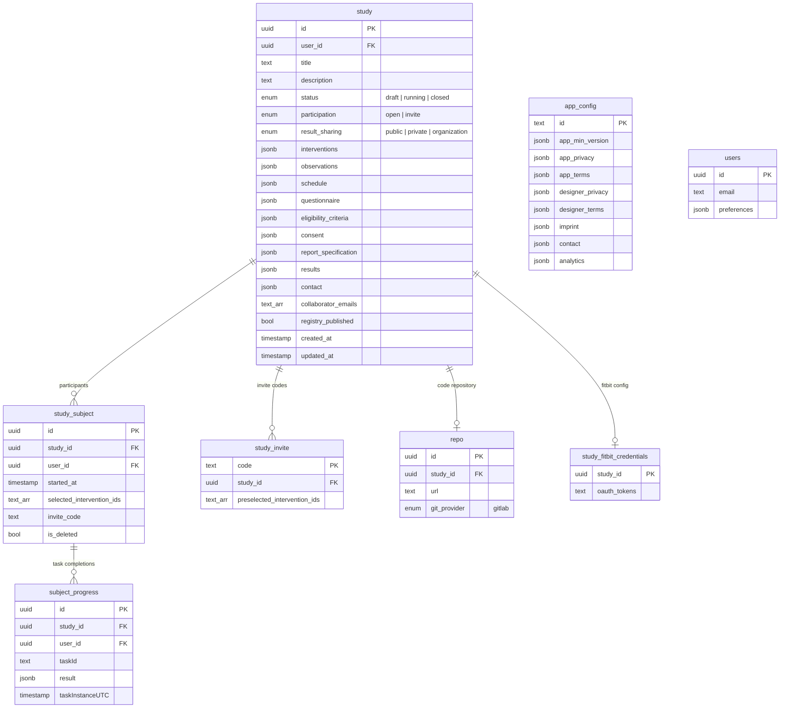
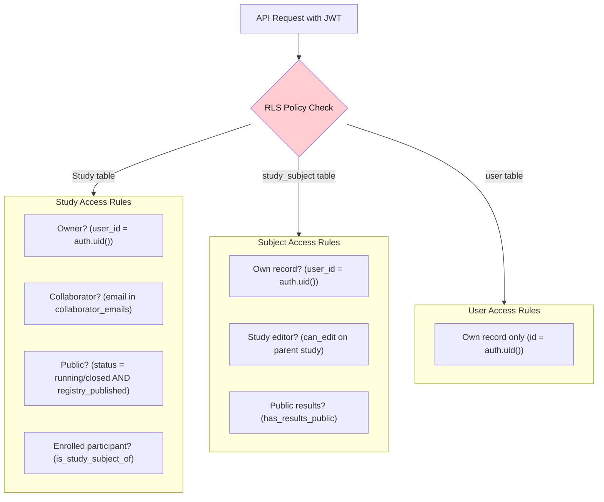

# Backend — Supabase

StudyU uses [Supabase](https://supabase.com/) as its backend, which provides PostgreSQL with Row Level Security, GoTrue authentication, file storage, and auto-generated REST APIs via PostgREST.

## Authentication Flow

**Supported method:** Email/password only (no OAuth or magic link).



**Key implementation details:**

- **Session persistence:** Uses `FlutterSecureStorage` (encrypted device storage) via a custom `SupabaseStorage` class. The session is serialized to JSON and stored under the key `supabasePersistSessionKey`. Access is synchronized via a `Lock` to prevent race conditions.
  - File: `flutter_common/lib/src/utils/storage.dart`

- **Auth repository (Designer):** Wraps Supabase auth in a reactive stream using RxDart's `BehaviorSubject<User?>`. The designer listens to auth state changes for route guards and UI updates.
  - File: `designer_v2/lib/repositories/auth_repository.dart`

- **Participant auth (App):** Participants are authenticated with auto-generated fake email/password credentials stored in `FlutterSecureStorage`. This provides a Supabase user identity for RLS without requiring participants to create real accounts.
  - File: `flutter_common/lib/src/utils/user.dart`

- **JWT expiry:** Configured at 3600 seconds (1 hour) with automatic refresh token rotation.

---

## Database Schema

The database has 8 primary tables. Most study configuration is stored as JSONB columns on the `study` table (interventions, observations, schedule, etc.), while participant data is normalized into separate tables.



**Computed database functions** (exposed via PostgREST as virtual columns):

| Function | Returns | Purpose |
|---|---|---|
| `study_participant_count()` | `int` | Count of non-deleted participants |
| `study_ended_count()` | `int` | Count of completed participants |
| `active_subject_count()` | `int` | Participants active within last 3 days |
| `study_missed_days()` | `int` | Consecutive days with no activity |
| `study_length()` | `int` | Total scheduled study duration |
| `subject_current_day()` | `int` | Participant's current day in study |

These functions are used by the Designer's monitoring dashboard to display participant activity without client-side computation.

---

## Row Level Security (RLS)

RLS is enabled on all tables. Every query is filtered by `auth.uid()` — the JWT's user ID. This means **the API cannot return data the user is not authorized to see**, regardless of what the client requests.



**Key RLS policies:**

| Policy | Table | Operation | Rule |
|---|---|---|---|
| Editors can do everything | `study` | ALL | `can_edit(auth.uid(), study.*)` — checks ownership or collaborator email |
| Public study visibility | `study` | SELECT | Status is `running`/`closed` AND (registry published OR open participation) |
| Participants can view joined study | `study` | SELECT | `is_study_subject_of(auth.uid(), study.id)` |
| Users manage own subjects | `study_subject` | ALL | `auth.uid() = user_id` |
| Editors see subjects | `study_subject` | SELECT | `can_edit` on parent study |
| App config is public | `app_config` | SELECT | Always `true` |

**Security helper functions** (privileges restricted to `authenticated` role only):

- `can_edit(user_id, study)` — returns `true` if the user owns the study or their email is in `collaborator_emails`
- `is_study_subject_of(user_id, study_id)` — returns `true` if the user is enrolled in the study
- `has_results_public(subject_id)` — checks if the study has public result sharing
- `allow_updating_only_study()` — trigger that prevents modifying restricted fields on non-draft studies

**Migration files:** `database/migration/` (16 migration files tracking schema evolution)

---

## Edge Functions & Storage

### Edge Functions

Two edge functions are defined but currently minimal/empty:
- `create-study` — study creation helper
- `study-import` — study import functionality

Configuration: Deno 1 runtime, defined in `supabase/config.toml`.

### Blob Storage

Supabase Storage is used for multimodal observation data (audio recordings, images from `AudioRecordingQuestion` and `ImageCapturingQuestion`).

- **Bucket:** `observations` (non-public)
- **File size limit:** 50 MiB
- **Path structure:** `{userId}_{studyId}_{timestamp}.{ext}`

**File:** `core/lib/src/util/multimodal/blob_storage_handler.dart`

```dart
// BlobStorageHandler operations (simplified)
Future<void> uploadObservation(String blobPath, File file)
Future<Uint8List> downloadObservation(String blobPath)
Future<List<FileObject>> removeObservation(List<String> blobPaths)
```

---

## Environment Configuration

The apps load configuration from `.env` files via `flutter_dotenv`:

| Variable | Purpose |
|---|---|
| `STUDYU_SUPABASE_URLs` | Comma-separated list of Supabase instance URLs (supports failover) |
| `STUDYU_SUPABASE_PUBLIC_ANON_KEY` | Public anonymous key for client access |
| `STUDYU_APP_URL` | URL of the participant app |
| `STUDYU_DESIGNER_URL` | URL of the designer app |
| `STUDYU_PROJECT_GENERATOR_URL` | Project generation service (optional) |

**URL failover logic** (`flutter_common/lib/src/utils/env_loader.dart`):

The environment loader supports multiple Supabase URLs. On initialization, it attempts to connect to each URL sequentially (5-second timeout per attempt), validates the connection by querying the `app_config` table, and uses the first working URL. This provides resilience against individual instance outages.

**Local development endpoints:**

| Service | URL |
|---|---|
| Supabase Studio | `http://localhost:54323` |
| Local REST API | `http://127.0.0.1:8082` |
| Local DB | `localhost:54322` |
| Test credentials | `user1@studyu.health` / `user1pass` |
