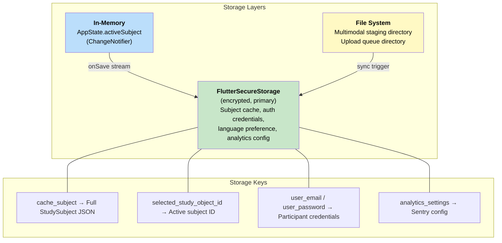
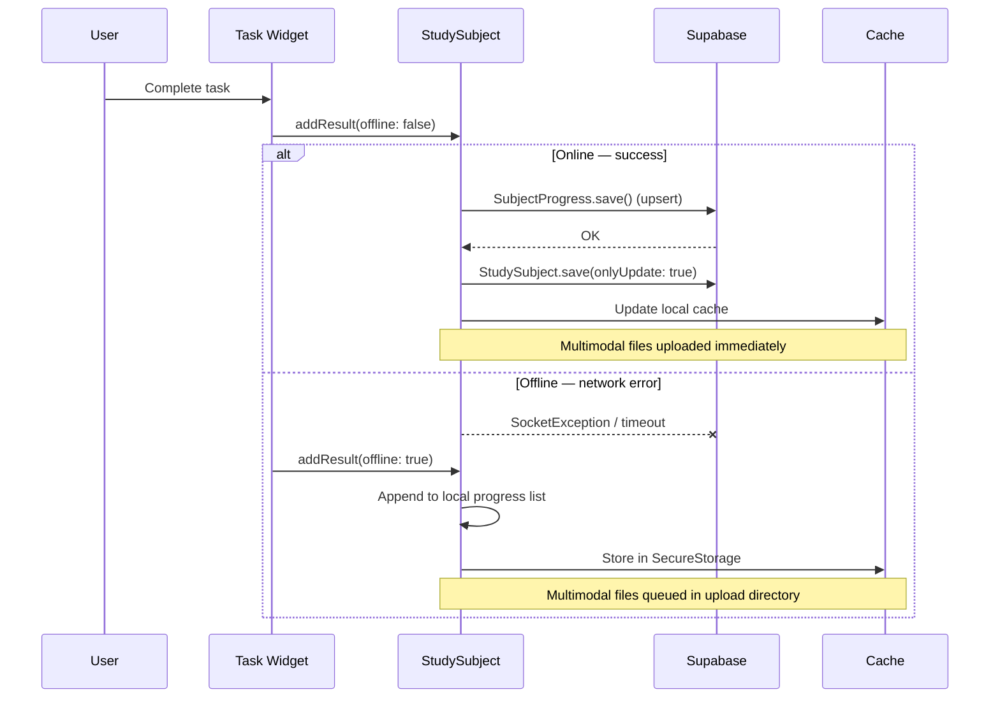
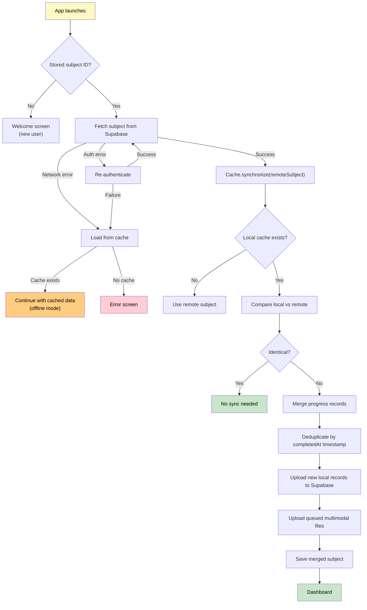

# Offline Capabilities

N-of-1 trials require participants to enter data daily, sometimes in environments with poor connectivity. StudyU handles this through an exception-based offline fallback with cache synchronization on reconnection.

## Local storage strategy

**Key files:**
- Cache management: `app/lib/util/cache.dart`
- Secure storage wrapper: `flutter_common/lib/src/utils/storage.dart`
- File staging: `app/lib/util/temporary_storage_handler.dart`

**What is cached:**
- The full `StudySubject` object (including nested `Study` and all `SubjectProgress` records), serialized to JSON in `FlutterSecureStorage`
- Multimodal files (audio recordings, images) in a local upload directory pending blob storage upload
- Participant credentials for re-authentication

**Cache write trigger:** The app listens to the `StudySubject.onSave` stream. Every time a subject is saved (locally or remotely), the cache is updated asynchronously.

---

## Offline Data Entry

The app uses a **try-online-first, catch-and-cache** pattern for submitting task results:

**Implementation:** `app/lib/util/study_subject_extension.dart`

The offline result submission:
1. Adds the `SubjectProgress` record to the in-memory `StudySubject.progress` list
2. Sets `completedAt` to `DateTime.now().toUtc()`
3. Moves multimodal files from staging to the upload directory (but does **not** upload them)
4. The result is persisted to `FlutterSecureStorage` via the cache, but **not** sent to Supabase

---

## Synchronization & Conflict Resolution

Sync happens at a single point: **app startup** on the loading screen.

**Implementation:** `app/lib/util/cache.dart` — `Cache.synchronize()`

**Conflict resolution strategy:**

| Scenario | Resolution |
|---|---|
| No local cache | Use remote subject as-is |
| Local and remote identical | No action needed |
| Remote has newer `startedAt` | Trust remote (study re-entry) |
| Progress lists differ | **Union merge** — combine both lists, deduplicate by `completedAt` timestamp |
| Multimodal files pending | Upload during sync |

The merge algorithm:
1. Combine all local `SubjectProgress` records with all remote records
2. Use a `HashSet` on `completedAt` `DateTime` to remove exact duplicates
3. Any records that exist locally but not remotely are batch-upserted to Supabase
4. Pending multimodal files in the upload directory are uploaded to blob storage
5. The merged `StudySubject` is saved both remotely and to the local cache

A `Cache.isSynchronizing` flag prevents concurrent sync operations.

---

## Connectivity Detection

StudyU does **not** use a dedicated connectivity package (like `connectivity_plus`). Instead, connectivity is detected implicitly through exception handling:

- **`SocketException`** — caught when network requests fail, triggers offline fallback
- **`PostgrestException`** — caught for database-level errors
- **Generic exceptions** — caught as catch-all for timeouts and malformed responses

There is no explicit online/offline indicator in the UI. The app silently falls back to cached data when network operations fail and syncs when connectivity is restored on the next app launch.

:::note
This implicit approach works because `SubjectProgress` records are append-only (no updates or deletes from the participant side), which makes the union-merge strategy safe. If the app ever needs to support editing or deleting progress records, a more sophisticated conflict resolution mechanism (such as vector clocks or CRDTs) would be needed.
:::
