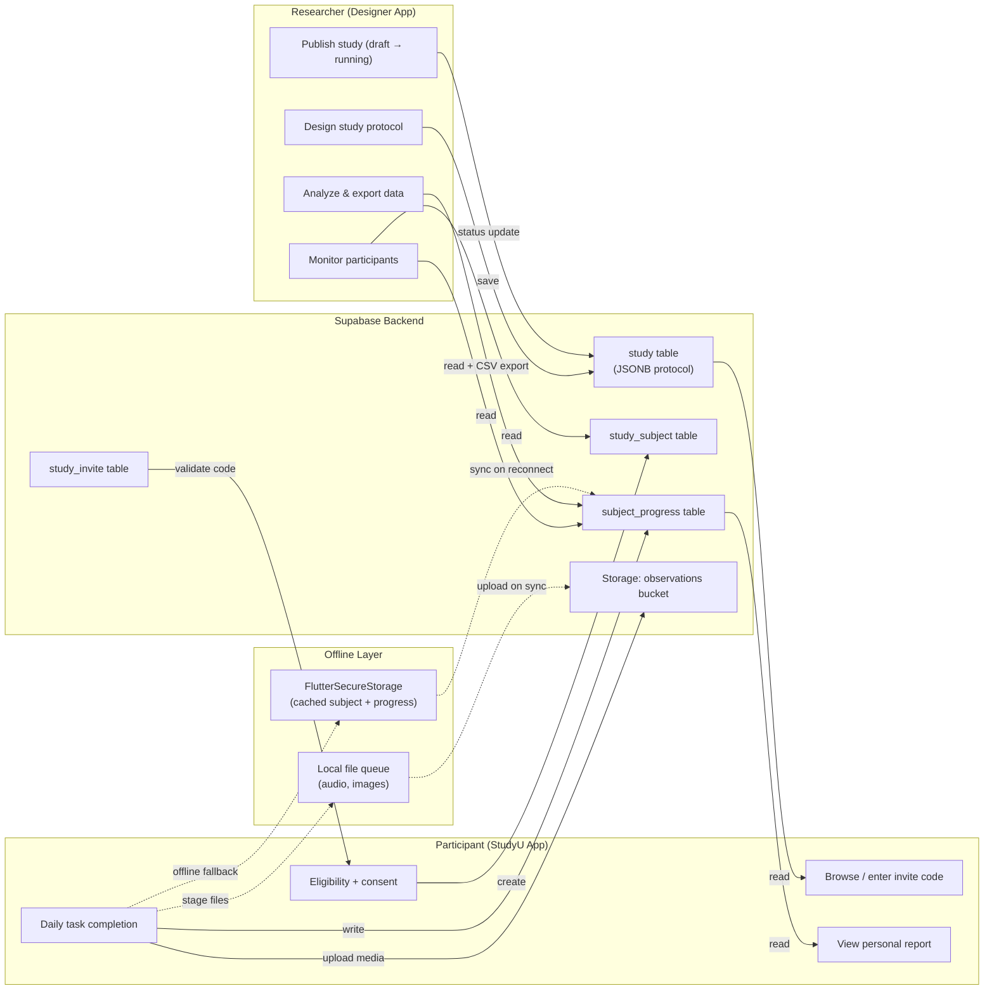
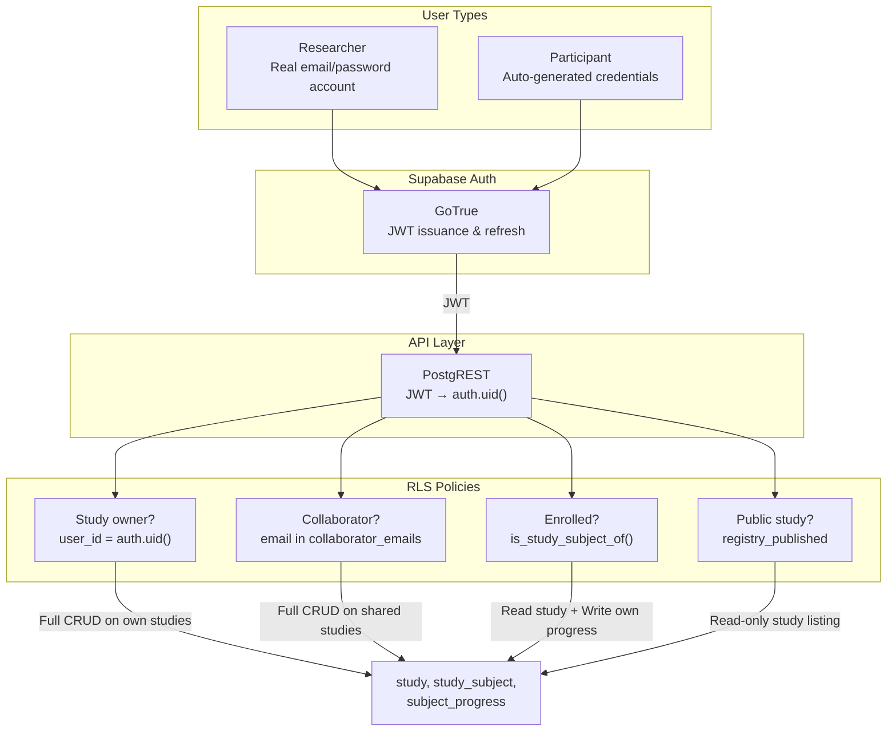
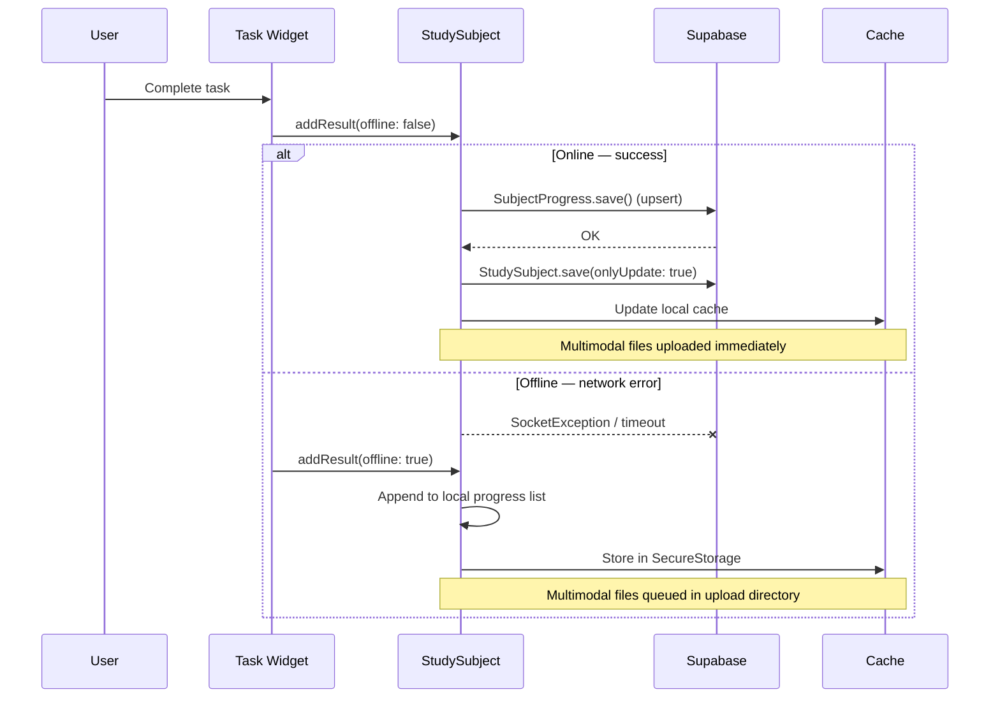
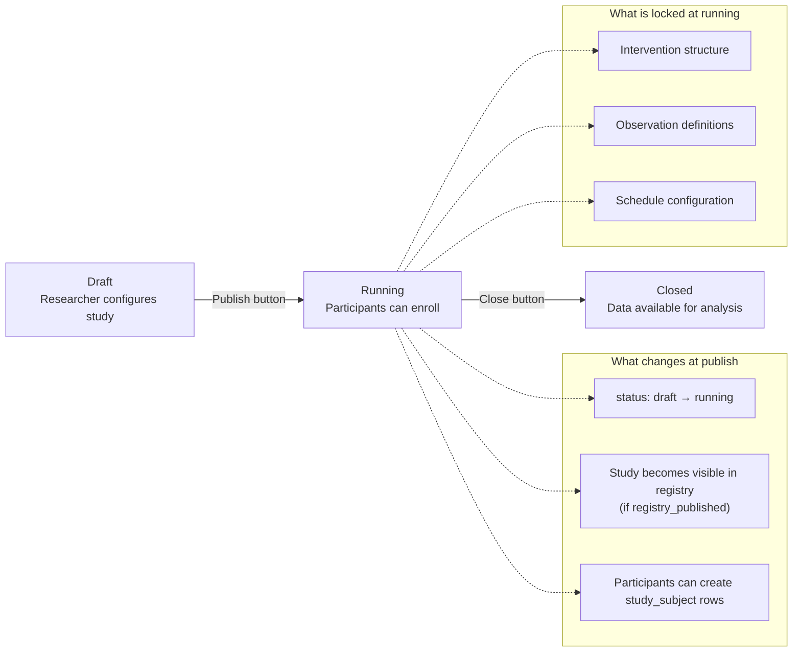

# Data Flow

This page shows the complete data flow through the StudyU system: from a researcher designing a study to a participant submitting results to data export.

## Full data flow: from study design to result analysis

## Authentication & authorization model

## Task completion data flow (detailed)

This sequence shows exactly what happens when a participant completes a task, online or offline:

## Study publishing flow

:::note
The `allow_updating_only_study()` database trigger prevents modification of locked fields on non-draft studies, enforcing this at the database level rather than relying on application-level guards.
:::
