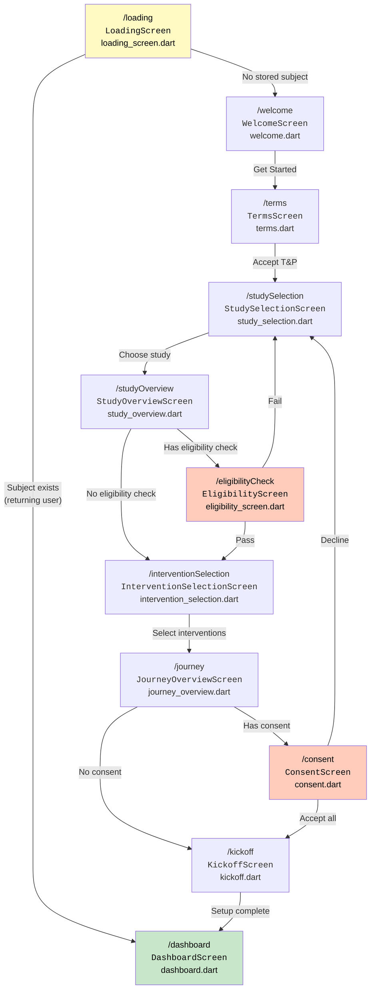
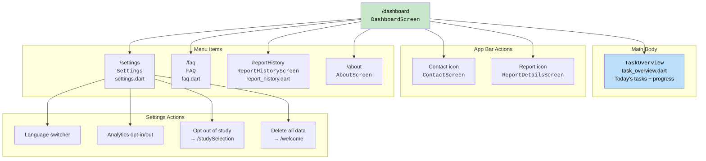

# App Screen Map

This page maps every screen in the participant app to its source file and shows the complete navigation flow. Use this as a reference when debugging or extending the app.

## Onboarding Sequence

The participant app follows a strict linear onboarding flow. Each screen must be completed before the next is shown. Some steps (eligibility, consent) are conditional on study configuration.

**Complete screen-to-file mapping (onboarding):**

| Step | Route | Widget Class | File | Purpose |
|------|-------|-------------|------|---------|
| 0 | `/loading` | `LoadingScreen` | `app/lib/screens/app_onboarding/loading_screen.dart` | Initialize app, check for stored subject, sync cache with remote |
| 1 | `/welcome` | `WelcomeScreen` | `app/lib/screens/app_onboarding/welcome.dart` | Landing page with "Get Started", About, Contact, FAQ links |
| 2 | `/about` | `AboutScreen` | `app/lib/screens/app_onboarding/about.dart` | 9-page vertical scroll explaining StudyU and N-of-1 trials |
| 3 | `/terms` | `TermsScreen` | `app/lib/screens/app_onboarding/terms.dart` | Accept Terms of Service and Privacy Policy |
| 4 | `/studySelection` | `StudySelectionScreen` | `app/lib/screens/study/onboarding/study_selection.dart` | Browse published studies or enter invite code |
| 5 | `/studyOverview` | `StudyOverviewScreen` | `app/lib/screens/study/onboarding/study_overview.dart` | Study details: duration, publisher, description, contact |
| 6 | `/eligibilityCheck` | `EligibilityScreen` | `app/lib/screens/study/onboarding/eligibility_screen.dart` | Eligibility questionnaire — criteria evaluated against answers |
| 7 | `/interventionSelection` | `InterventionSelectionScreen` | `app/lib/screens/study/onboarding/intervention_selection.dart` | Select 2 interventions (if study has >2 available) |
| 8 | `/journey` | `JourneyOverviewScreen` | `app/lib/screens/study/onboarding/journey_overview.dart` | Timeline preview showing intervention phases and end date |
| 9 | `/consent` | `ConsentScreen` | `app/lib/screens/study/onboarding/consent.dart` | Grid of consent cards — all must be accepted to proceed |
| 10 | `/kickoff` | `KickoffScreen` | `app/lib/screens/study/onboarding/kickoff.dart` | Save `StudySubject`, schedule notifications, finalize enrollment |

**Navigation patterns used:**
- Onboarding screens use `Navigator.pushNamed()` (add to stack)
- Eligibility check uses `Navigator.push()` (modal overlay)
- Kickoff uses `Navigator.pushNamedAndRemoveUntil()` (clears entire stack before showing dashboard — prevents back-navigation to onboarding)

---

## Dashboard & Main App

Once enrolled, the dashboard is the participant's home screen. It shows today's tasks and provides access to reports, settings, and support.

**Dashboard sub-screen mapping:**

| Route | Widget Class | File | Purpose |
|-------|-------------|------|---------|
| (inline) | `TaskOverview` | `app/lib/screens/study/dashboard/task_overview_tab/task_overview.dart` | Lists today's tasks, shows completion progress |
| `/contact` | `ContactScreen` | `app/lib/screens/study/dashboard/contact_tab/contact_screen.dart` | App support + study-specific contact info |
| `/faq` | `FAQ` | `app/lib/screens/study/dashboard/contact_tab/faq.dart` | Frequently asked questions (EN/DE) |
| `/settings` | `Settings` | `app/lib/screens/study/dashboard/settings.dart` | Language, analytics, opt-out, delete data |
| (chart icon) | `ReportDetailsScreen` | `app/lib/screens/study/report/report_details.dart` | Current study results with statistical sections |
| `/reportHistory` | `ReportHistoryScreen` | `app/lib/screens/study/report/report_history.dart` | Past studies and their reports |

**Study completion flow:** When a participant finishes all study days, the dashboard shows a `StudyFinishedPlaceholder` with options to view the report or return to study selection.

---

## Error & Status Screens

| Route | Widget Class | File | Trigger |
|-------|-------------|------|---------|
| `/appError` | `AppErrorScreen` | `app/lib/screens/app_onboarding/app_error_screen.dart` | Supabase auth or network error on startup |
| `/appOutdated` | `AppOutdatedScreen` | `app/lib/screens/app_onboarding/app_outdated_screen.dart` | App version below `app_min_version` from `AppConfig` |

`AppErrorScreen` includes: debug information display, "Contact Support" button, and a "Delete Data & Restart" option for recovery.
