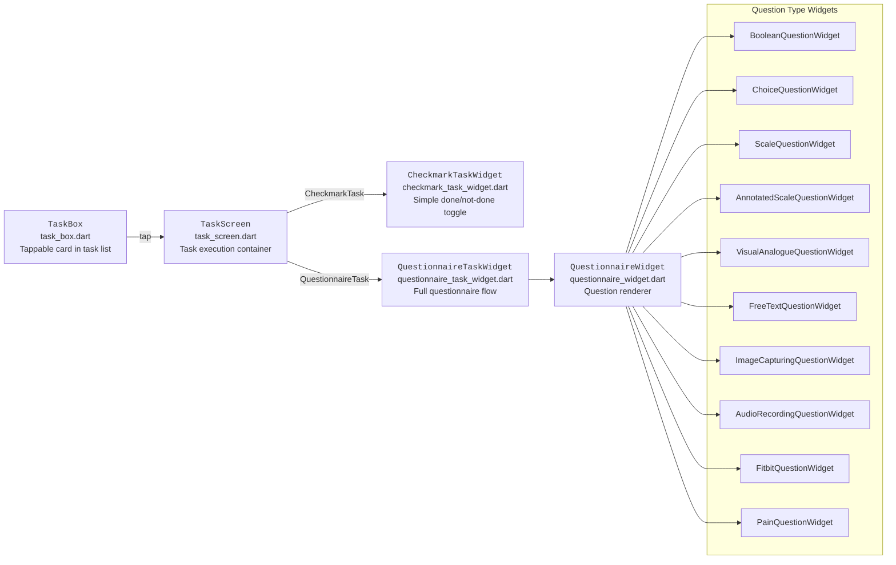

# Task System

When a participant taps a task in the `TaskOverview`, a `TaskScreen` is pushed modally. The screen renders the appropriate widget based on task type.

## Task completion flow

## Question widget file mapping

| Question Type | Widget Class | File |
|---|---|---|
| `BooleanQuestion` | `BooleanQuestionWidget` | `app/lib/widgets/questionnaire/questions/boolean_question_widget.dart` |
| `ChoiceQuestion` | `ChoiceQuestionWidget` | `app/lib/widgets/questionnaire/questions/choice_question_widget.dart` |
| `ScaleQuestion` | `ScaleQuestionWidget` | `app/lib/widgets/questionnaire/questions/scale_question_widget.dart` |
| `AnnotatedScaleQuestion` | `AnnotatedScaleQuestionWidget` | `app/lib/widgets/questionnaire/questions/annotated_scale_question_widget.dart` |
| `VisualAnalogueQuestion` | `VisualAnalogueQuestionWidget` | `app/lib/widgets/questionnaire/questions/visual_analogue_question_widget.dart` |
| `FreeTextQuestion` | `FreeTextQuestionWidget` | `app/lib/widgets/questionnaire/questions/free_text_question_widget.dart` |
| `ImageCapturingQuestion` | `ImageCapturingQuestionWidget` | `app/lib/widgets/questionnaire/questions/image_capturing_question_widget.dart` |
| `AudioRecordingQuestion` | `AudioRecordingQuestionWidget` | `app/lib/widgets/questionnaire/questions/audio_recording_question_widget.dart` |
| `FitbitQuestion` | `FitbitQuestionWidget` | `app/lib/widgets/questionnaire/questions/fitbit_question_widget.dart` |
| `PainQuestion` | `PainQuestionWidget` | `app/lib/widgets/questionnaire/questions/pain_question_widget.dart` |

## Task result submission

After a task is completed, the `TaskScreen` calls `StudySubject.addResult()`. This method:

1. Creates a `SubjectProgress` record with the task result
2. Attempts to write to Supabase (`SubjectProgress.save()`)
3. On success: updates the remote `StudySubject` record and local cache
4. On `SocketException` or network error: stores the result in `FlutterSecureStorage` for later sync

See [Offline Capabilities](../03-architecture/05-offline-capabilities.mdx) for the full sync lifecycle.

## Completion period tracking

A task can have multiple `CompletionPeriod` time windows (e.g., a morning window 08:00–12:00 and an evening window 18:00–20:00). Each window must be completed separately. The `SubjectProgress.result.periodId` field ties a completion event to the specific window.

`StudySubject.completedTaskForDay(taskId, date)` returns `true` if **all** completion periods for the task have a matching `SubjectProgress` record for the given date.

The `TaskBox` in the dashboard shows:
- Empty state — task not yet completed
- Partially filled — some periods completed
- Full — all periods completed
