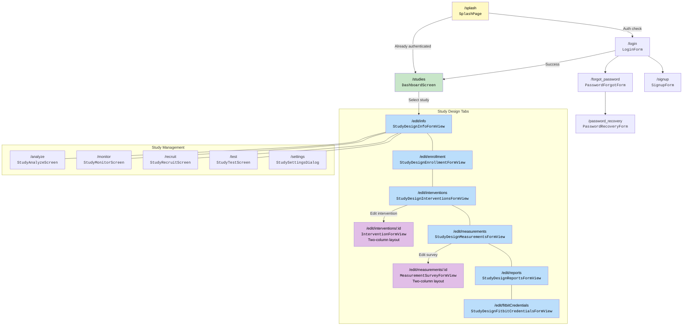

# Designer Screen Map

The StudyU Designer is a web application used by researchers to design, publish, monitor, and analyze N-of-1 studies. It uses GoRouter for navigation, Riverpod for state management, and Reactive Forms for form handling with debounced auto-save.

## Full navigation map

All study screens are wrapped in a `StudyScaffold` that provides:
- Top navigation tabs for design sections (Info, Enrollment, Interventions, Measurements, Reports)
- Study status badge (Draft / Running / Closed)
- Publish / Close study actions
- Sync indicator showing save status

## Authentication screens

| Route | Widget | File | Purpose |
|-------|--------|------|---------|
| `/login` | `LoginForm` | `designer_v2/lib/features/auth/login_form_view.dart` | Email + password login. Links to signup and forgot password |
| `/signup` | `SignupForm` | `designer_v2/lib/features/auth/signup_form_view.dart` | Email, password, confirm password, ToS checkbox |
| `/forgot_password` | `PasswordForgotForm` | `designer_v2/lib/features/auth/password_forgot_form_view.dart` | Request password reset email |
| `/password_recovery` | `PasswordRecoveryForm` | `designer_v2/lib/features/auth/password_recovery_form_view.dart` | Set new password (after clicking email link) |

**Controller:** All auth screens share `AuthFormController` (`designer_v2/lib/features/auth/auth_form_controller.dart`), differentiated by `AuthFormKey` enum (`login`, `signup`, `passwordForgot`, `passwordRecovery`, `passwordReset`).

## Dashboard (Studies List)

**Route:** `/studies`
**Widget:** `DashboardScreen`
**File:** `designer_v2/lib/features/dashboard/dashboard_page.dart`
**Controller:** `DashboardController` (`designer_v2/lib/features/dashboard/dashboard_controller.dart`)

The dashboard is the researcher's home screen after login. It displays:

- **Studies table** — all studies owned by or shared with the researcher
- **Search bar** — filter studies by title/description
- **Status filter** — filter by Draft / Running / Closed
- **Pin/unpin** — mark favorite studies for quick access
- **"New Study" button** — create a new study (starts in Draft status)
