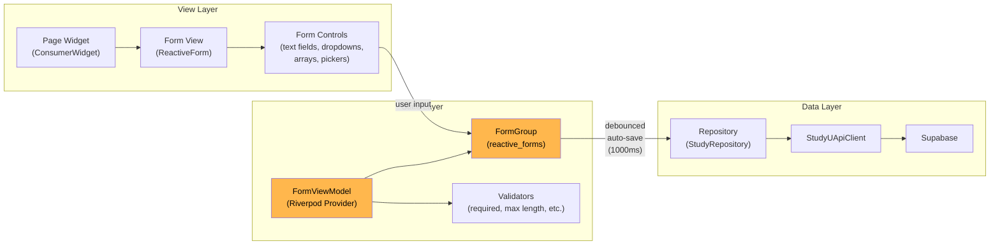

# Form Architecture

All design screens follow a consistent pattern: `reactive_forms` `FormGroup` instances managed by Riverpod providers, with debounced auto-save to Supabase.

## Form pattern



**Key architectural points:**
- Forms auto-save on change with 1000ms debounce — no explicit "Save" button needed
- A `SyncIndicator` widget shows the current save status (saving, saved, error)
- `FormViewModel` classes manage `FormGroup` / `FormArray` instances from the `reactive_forms` package
- Each design tab has its own form controller that maps between the `Study` domain model and reactive form state
- Two-column layouts (for editing interventions and surveys) show the form on the left and a live preview on the right

---

## Common view components

| Component | File | Purpose |
|---|---|---|
| `SingleColumnLayout` | `designer_v2/lib/common_views/layout_single_column.dart` | Configurable widths: narrow, wide, stretched, split |
| `TwoColumnLayout` | `designer_v2/lib/common_views/layout_two_column.dart` | Side-by-side layout for form + preview (7:8 flex ratio) |
| `FormScaffold` | `designer_v2/lib/common_views/form_scaffold.dart` | Form wrapper with app bar, action buttons, unsaved changes dialog |
| `FormTableLayout` | `designer_v2/lib/common_views/form_table_layout.dart` | Label + input pair layout for consistent form alignment |
| `AsyncValueWidget` | `designer_v2/lib/common_views/async_value_widget.dart` | Handles loading / error / data states for async providers |
| `EmptyBody` | `designer_v2/lib/common_views/empty_body.dart` | Placeholder when lists are empty (icon + title + description) |
| `Banner` / `BannerBox` | `designer_v2/lib/common_views/banner.dart` | Info/warning messages (e.g., "Study is in draft") |
| `SyncIndicator` | `designer_v2/lib/common_views/sync_indicator.dart` | Visual save status feedback |
| `Sidesheet` | `designer_v2/lib/common_views/sidesheet/sidesheet.dart` | Slide-in panel for detail views (e.g., participant details) |

---

## Two-column layout

The interventions and measurements tabs use `TwoColumnLayout` when editing a single item. The flex ratio is 7:8 (form:preview).

```
┌─────────────────────────┬──────────────────────────────┐
│  Form (7 parts)         │  Live Preview (8 parts)      │
│                         │                              │
│  Title field            │  [Renders the intervention   │
│  Description field      │   or survey exactly as it    │
│  Task list              │   appears in the app]        │
│  Schedule config        │                              │
└─────────────────────────┴──────────────────────────────┘
```

This allows researchers to see the participant-facing result of their configuration in real time while editing.
