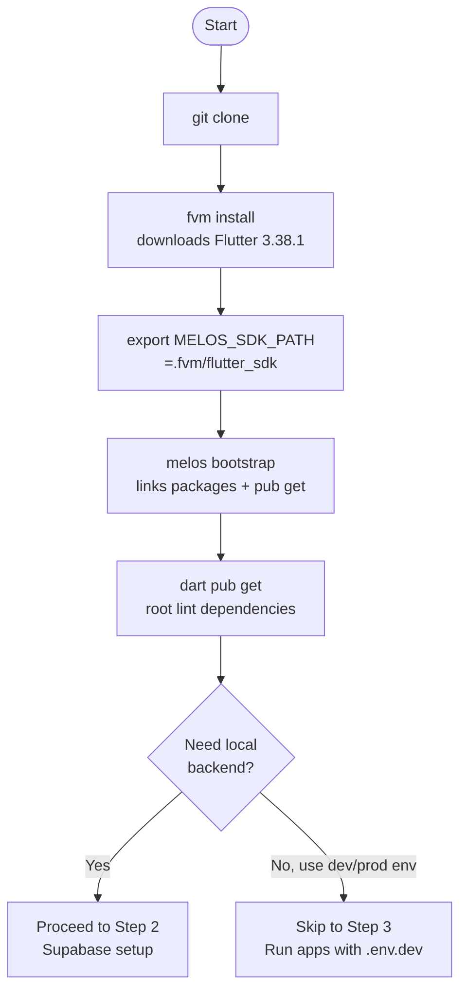

# Clone and Bootstrap

After this step you will have all Dart packages linked and ready to compile.

## Clone the repository

```bash
git clone https://github.com/hpi-studyu/studyu.git
cd studyu
```

## Install the pinned Flutter SDK

```bash
fvm install
```

FVM reads `.fvmrc` at the repo root, which specifies `"flutter": "3.38.1"`. This command downloads and caches that exact SDK under `.fvm/flutter_sdk/`. The download is ~600 MB on first run.

## Set the SDK path for Melos

```bash
export MELOS_SDK_PATH=.fvm/flutter_sdk
```

:::note
Melos needs this environment variable to find the correct Flutter SDK when running scripts. Add it to your shell profile (`.zshrc`, `.bashrc`) so it is set automatically in every terminal session, or your `melos run` commands will use whatever `flutter` is on your system `PATH`.
:::

## Bootstrap the monorepo

```bash
melos bootstrap
```

This links the four packages to each other (so `app` can import `core` as a path dependency), then runs `flutter pub get` in each package. It also generates IDE run configurations for Android Studio and VS Code.

## Initialize the root project

```bash
dart pub get
```

This installs the root-level dev dependencies, which include the lint configuration that applies consistently across all packages.

## Setup flow



Continue to [Local Supabase](./03-local-supabase.mdx) to start the local backend.
