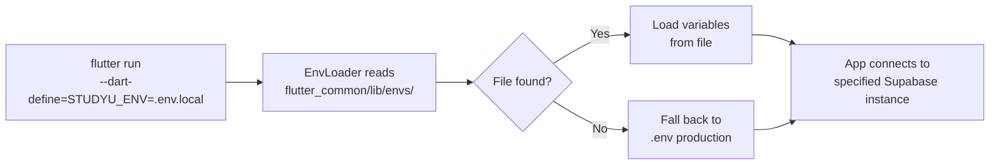

# Environment Configuration

Environment files control which Supabase instance the apps connect to. This is the mechanism that switches between local, development, and production backends without recompiling.

## How environment selection works



## Environment files

All files live in `flutter_common/lib/envs/`:

| File | Backend | When to use |
|---|---|---|
| `.env` | Production | Default when no `STUDYU_ENV` is specified |
| `.env.dev` | Development database | Day-to-day development against shared dev data |
| `.env.local` | Local Docker Supabase | Local development and feature work with seeded data |
| `.env.local.example` | — | Template for `.env.local` — committed to git |

:::note
`.env` and `.env.dev` are committed to git because they contain only public configuration (Supabase URLs and anonymous keys — not secrets). `.env.local` is gitignored because each developer generates it locally from the template.
:::

## Environment variables

```bash
# URL of the Supabase instance (comma-separated list supports failover)
STUDYU_SUPABASE_URLS=http://127.0.0.1:8082

# Public anonymous key — safe to expose in client code
STUDYU_SUPABASE_PUBLIC_ANON_KEY=<anon key from supabase start output>

# Optional: URL of the study protocol generator service
STUDYU_PROJECT_GENERATOR_URL=

# URLs used for deep links and redirects
STUDYU_APP_URL=http://localhost:8080/
STUDYU_DESIGNER_URL=http://localhost:8081/
```

## Selecting an environment at runtime

Pass the filename (not the full path) as `STUDYU_ENV`:

```bash
# Use local Supabase
flutter run -d chrome --web-port 8080 --dart-define=STUDYU_ENV=.env.local

# Use development backend
flutter run -d chrome --web-port 8080 --dart-define=STUDYU_ENV=.env.dev
```

The `melos run local:*` and `melos run dev:*` scripts do this for you automatically.

## URL failover

The `STUDYU_SUPABASE_URLS` variable accepts a comma-separated list of URLs. On initialization, the app attempts to connect to each URL sequentially (5-second timeout per attempt), validates the connection by querying the `app_config` table, and uses the first working URL.

This provides resilience against individual instance outages in multi-instance production deployments.

**Implementation:** `flutter_common/lib/src/utils/env_loader.dart`
