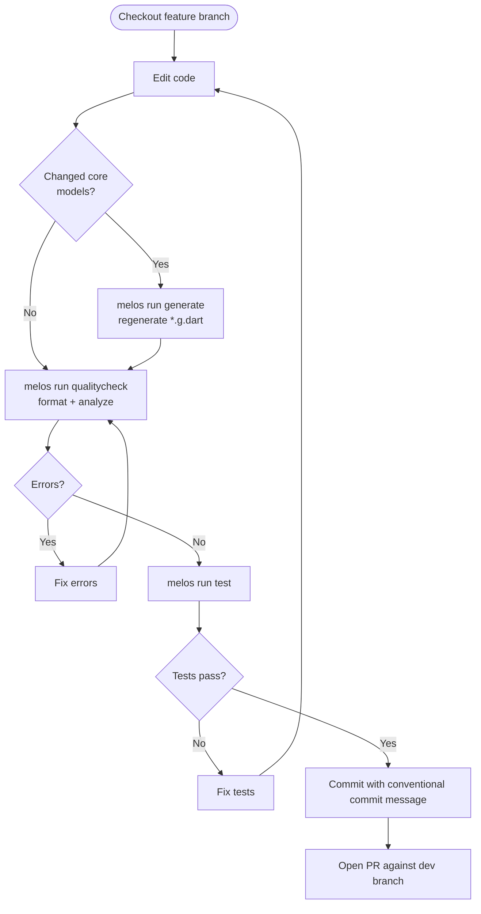

# Edit-Build-Test Cycle

## Typical workflow

## Quality commands

Run these from the repo root. All scripts are defined in `pubspec.yaml` under `melos.scripts`.

| Command | What it does |
|---|---|
| `melos format` | Formats all Dart files using `dart format` |
| `melos run fix` | Applies auto-fixable lint errors with `dart fix --apply` |
| `melos run test` | Runs `flutter test` in every package that has a `test/` directory |
| `melos run generate` | Regenerates `*.g.dart` files in `core` and `designer_v2` |
| `melos run qualitycheck` | Runs format → generate → `flutter analyze` in sequence |
| `melos run reset` | Full clean reset: `git clean`, `melos clean`, `flutter clean`, `melos bootstrap` |
| `melos run outdated` | Lists outdated dependencies in all packages |
| `melos run upgrade` | Upgrades all dependencies and re-bootstraps |

Run `melos run qualitycheck` before opening a pull request. It is the closest equivalent to what CI checks.

## Branch strategy

- Base feature branches on `dev`, not `main`
- Open pull requests against `dev`
- `main` receives merges from `dev` on release
