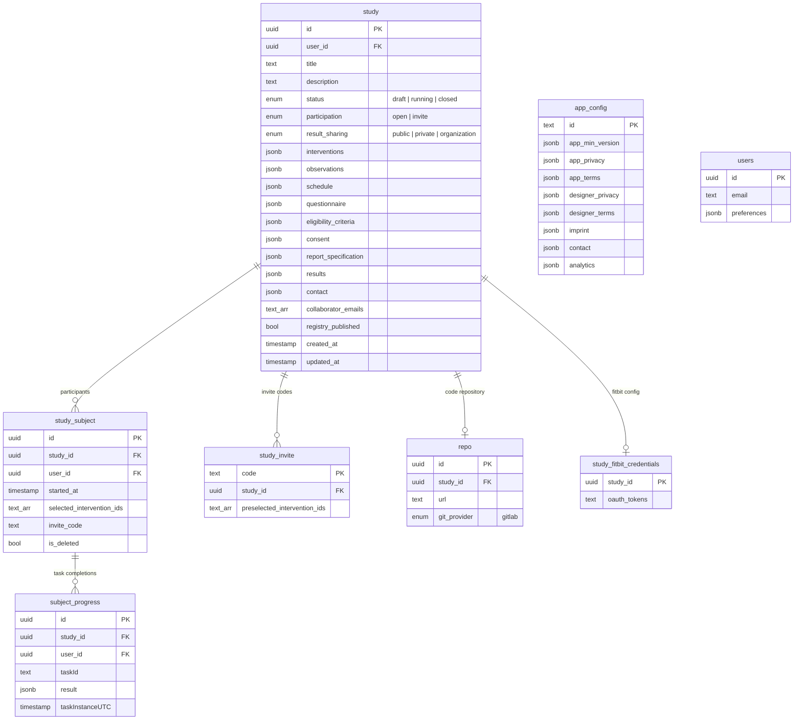

# Database Schema

The StudyU database runs PostgreSQL 15 via Supabase. There are 8 primary tables and a `mockup` schema used only for seeding.

## Table overview

---

## `study` table

The aggregate root. Most of the study protocol is stored as JSONB columns.

| Column | Type | Nullable | Default | Description |
|---|---|---|---|---|
| `id` | `uuid` | No | `gen_random_uuid()` | Primary key |
| `user_id` | `uuid` | No | — | Owner's auth user ID (FK to `auth.users`) |
| `title` | `text` | Yes | `null` | Study display name |
| `description` | `text` | Yes | `''` | Free-text description |
| `status` | `enum` | No | `'draft'` | `draft`, `running`, or `closed` |
| `participation` | `enum` | No | `'invite'` | `open` or `invite` |
| `result_sharing` | `enum` | No | `'private'` | `public`, `private`, or `organization` |
| `interventions` | `jsonb` | No | `'[]'` | Array of `Intervention` objects |
| `observations` | `jsonb` | No | `'[]'` | Array of `Observation` objects |
| `schedule` | `jsonb` | No | `'{}'` | `StudySchedule` object |
| `questionnaire` | `jsonb` | No | `'[]'` | Eligibility screening questions |
| `eligibility_criteria` | `jsonb` | No | `'[]'` | `EligibilityCriterion` array |
| `consent` | `jsonb` | No | `'[]'` | `ConsentItem` array |
| `report_specification` | `jsonb` | No | `'{}'` | `ReportSpecification` object |
| `results` | `jsonb` | No | `'[]'` | `StudyResult` array |
| `contact` | `jsonb` | No | `'{}'` | `Contact` object |
| `collaborator_emails` | `text[]` | No | `'{}'` | Array of researcher emails with edit access |
| `registry_published` | `bool` | No | `false` | Whether visible in public registry |
| `published` | `bool` | No | `false` | Deprecated — use `status` instead |
| `icon_name` | `text` | No | `'accountHeart'` | Material icon identifier |
| `created_at` | `timestamptz` | No | `now()` | Creation timestamp |
| `updated_at` | `timestamptz` | No | `now()` | Last modification timestamp |

---

## `study_subject` table

Enrollment record for a participant in a study.

| Column | Type | Nullable | Description |
|---|---|---|---|
| `id` | `uuid` | No | Primary key |
| `study_id` | `uuid` | No | FK to `study.id` |
| `user_id` | `uuid` | No | FK to `auth.users.id` |
| `started_at` | `timestamptz` | Yes | UTC timestamp when participant began |
| `selected_intervention_ids` | `text[]` | No | The two intervention UUIDs assigned to this participant |
| `invite_code` | `text` | Yes | Code used to join an invite-only study |
| `is_deleted` | `bool` | No | Soft-delete flag (participant withdrew) |

---

## `subject_progress` table

One row per task completion event.

| Column | Type | Nullable | Description |
|---|---|---|---|
| `id` | `uuid` | No | Primary key |
| `study_id` | `uuid` | No | FK to `study.id` |
| `user_id` | `uuid` | No | FK to `auth.users.id` |
| `taskId` | `text` | No | UUID of the completed task |
| `result` | `jsonb` | No | `Result<QuestionnaireState>` or `Result<bool>` payload |
| `taskInstanceUTC` | `timestamptz` | No | UTC timestamp of completion |

:::note
The primary key for `subject_progress` is effectively `(user_id, taskId, taskInstanceUTC)` — a participant can complete the same task multiple times across different days.
:::

---

## `study_invite` table

Invite codes for invite-only studies.

| Column | Type | Nullable | Description |
|---|---|---|---|
| `code` | `text` | No | Primary key — the shareable code string |
| `study_id` | `uuid` | No | FK to `study.id` |
| `preselected_intervention_ids` | `text[]` | No | Optional pre-assignment of interventions to invitees |

---

## `app_config` table

Global platform configuration. One row, read by all clients on startup.

| Column | Type | Description |
|---|---|---|
| `id` | `text` | Primary key |
| `app_min_version` | `jsonb` | `{"android": "2.6.0", "ios": "2.6.0"}` — forces app updates |
| `app_privacy` | `jsonb` | `{"en": "url", "de": "url"}` — privacy policy URLs |
| `app_terms` | `jsonb` | `{"en": "url", "de": "url"}` — terms of service URLs |
| `designer_privacy` | `jsonb` | Same structure for designer app |
| `designer_terms` | `jsonb` | Same structure for designer app |
| `imprint` | `jsonb` | `{"en": "url", "de": "url"}` — legal imprint URLs |
| `contact` | `jsonb` | `{"email": "...", "phone": "...", "website": "..."}` |
| `analytics` | `jsonb` | `{"enabled": true, "dsn": "...", "samplingRate": 1.0}` — Sentry config |

---

## `users` table

Researcher account preferences. Separate from `auth.users` (which GoTrue manages).

| Column | Type | Description |
|---|---|---|
| `id` | `uuid` | Primary key — matches `auth.users.id` |
| `email` | `text` | Researcher email |
| `preferences` | `jsonb` | `{"lang": "en", "pinned_studies": ["uuid", ...]}` |

---

## Computed database functions

These SQL functions are exposed via PostgREST as computed columns on the `study` table. They are called by the Designer's monitoring dashboard.

| Function | Returns | Purpose |
|---|---|---|
| `study_participant_count()` | `int` | Count of non-deleted participants |
| `study_ended_count()` | `int` | Count of completed participants |
| `active_subject_count()` | `int` | Participants active within last 3 days |
| `study_missed_days()` | `int` | Consecutive days with no activity |
| `study_length()` | `int` | Total scheduled study duration in days |
| `subject_current_day()` | `int` | Participant's current day in the study |

---

## `mockup` schema

Used exclusively in seeding and testing. Contains two helper functions:

| Function | Purpose |
|---|---|
| `mockup.create_user(email, password)` | Creates a user in `auth.users` with a bcrypt-hashed password. Returns the new user's UUID. |
| `mockup.get_user(email)` | Retrieves a user record from `auth.users` by email. |
