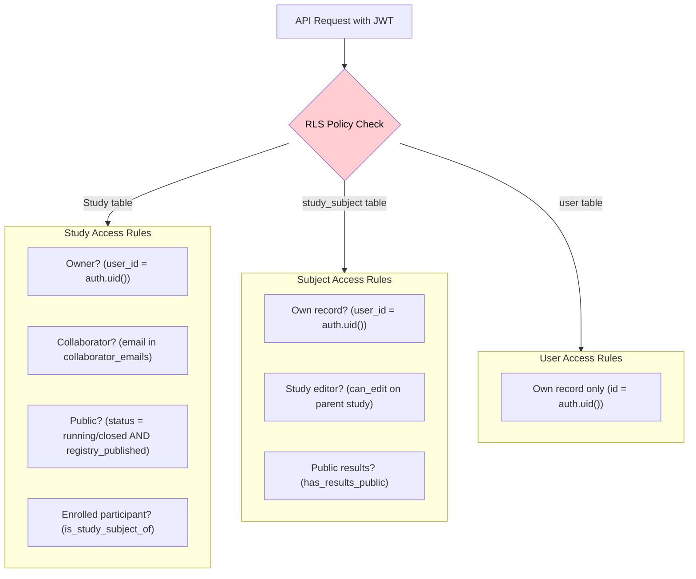

# Row Level Security (RLS)

RLS is enabled on all tables. Every query is filtered by `auth.uid()` — the JWT's user ID. This means **the API cannot return data the user is not authorized to see**, regardless of what the client requests.

## Access model overview

## Policy table

| Policy | Table | Operation | Rule |
|---|---|---|---|
| Editors can do everything | `study` | ALL | `can_edit(auth.uid(), study.*)` — checks ownership or collaborator email |
| Public study visibility | `study` | SELECT | Status is `running`/`closed` AND (registry published OR open participation) |
| Participants can view joined study | `study` | SELECT | `is_study_subject_of(auth.uid(), study.id)` |
| Users manage own subjects | `study_subject` | ALL | `auth.uid() = user_id` |
| Editors see subjects | `study_subject` | SELECT | `can_edit` on parent study |
| Public subject results | `study_subject` | SELECT | `has_results_public(subject.id)` |
| App config is public | `app_config` | SELECT | Always `true` |
| Own user record | `users` | ALL | `auth.uid() = id` |

## Security helper functions

These functions are defined with restricted privileges (`SECURITY DEFINER`, accessible only by the `authenticated` role):

### `can_edit(user_id, study)`

Returns `true` if the user owns the study (`study.user_id = user_id`) OR their email appears in `study.collaborator_emails`.

Used in: `study` table policies (ALL operations), `study_subject` SELECT policy.

### `is_study_subject_of(user_id, study_id)`

Returns `true` if a `study_subject` row exists with matching `user_id` and `study_id` and `is_deleted = false`.

Used in: `study` SELECT policy for enrolled participants.

### `has_results_public(subject_id)`

Returns `true` if the study associated with the subject has `result_sharing = 'public'`.

Used in: `study_subject` SELECT policy for public result access.

### `allow_updating_only_study()` trigger

A database trigger (not a function called from application code) that fires on `UPDATE` to the `study` table. It prevents modification of locked fields (interventions, observations, schedule) when the study is not in `draft` status.

This enforces study protocol immutability at the database level, not just in the application layer.

## Authentication and user types

| User type | Auth method | RLS identity |
|---|---|---|
| Researcher | Real email/password via GoTrue | `auth.uid()` = researcher's UUID |
| Participant | Auto-generated fake credentials | `auth.uid()` = participant's UUID |
| Unauthenticated | No JWT | All RLS policies return `false` — no data returned |

Participants use auto-generated credentials (`flutter_common/lib/src/utils/user.dart`) because the app does not require them to create real accounts. Their UUID still serves as an identity for RLS filtering.
