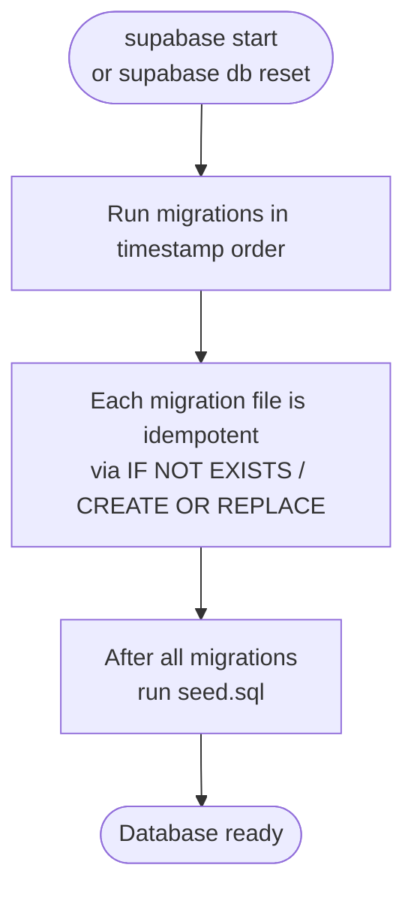

# Migrations

The database schema is managed through sequential SQL migration files in `database/migration/`.

## How migrations work



Supabase CLI tracks which migrations have been applied via the `supabase_migrations.schema_migrations` table. Running `supabase db reset` replays all migrations from scratch.

## Existing migration files

The `database/migration/` directory contains 16 migration files. The two foundational ones are:

| File | Purpose |
|---|---|
| `0000000000001_studyu-schema.sql` | Creates all public schema tables, enums, indexes, and triggers |
| `0000000000002_mockup-schema.sql` | Creates the `mockup` schema with test helper functions |

Subsequent migrations add columns, modify policies, or update functions as the schema evolved.

## Adding a new migration

1. Create a new file in `database/migration/` with a timestamp prefix higher than the latest existing file:

```bash
# Example: creating a migration after 0000000000016_...
touch database/migration/0000000000017_add_my_feature.sql
```

2. Write the SQL in the file. Use `IF NOT EXISTS` and `OR REPLACE` to make it idempotent:

```sql
-- Example: adding a column
ALTER TABLE study ADD COLUMN IF NOT EXISTS my_new_column text;

-- Example: creating a function
CREATE OR REPLACE FUNCTION my_new_function()
RETURNS void AS $$
BEGIN
  -- implementation
END;
$$ LANGUAGE plpgsql;
```

3. Apply the migration to your local database:

```bash
supabase db reset
```

Or, to apply only the new migration without resetting:

```bash
supabase migration up
```

4. Update the corresponding Dart model in `core/` if the schema change affects serialized data. Then run:

```bash
melos run generate
```

5. Stage and commit the migration file, model changes, and generated files together.

:::warning
Never edit an existing migration file that has already been applied to any environment (local, dev, or production). Always create a new migration file to modify existing schema objects.
:::
